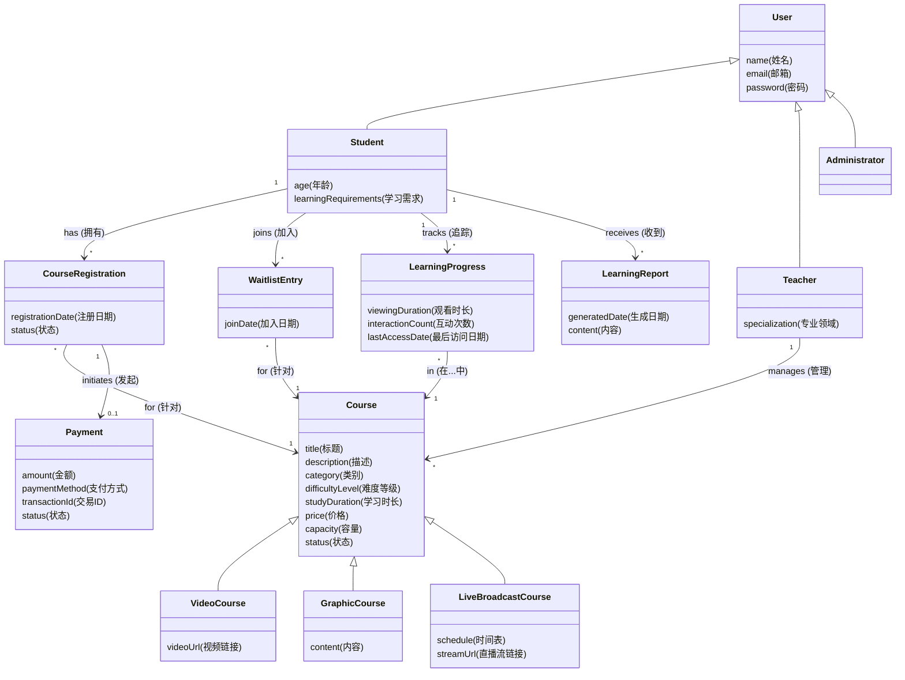
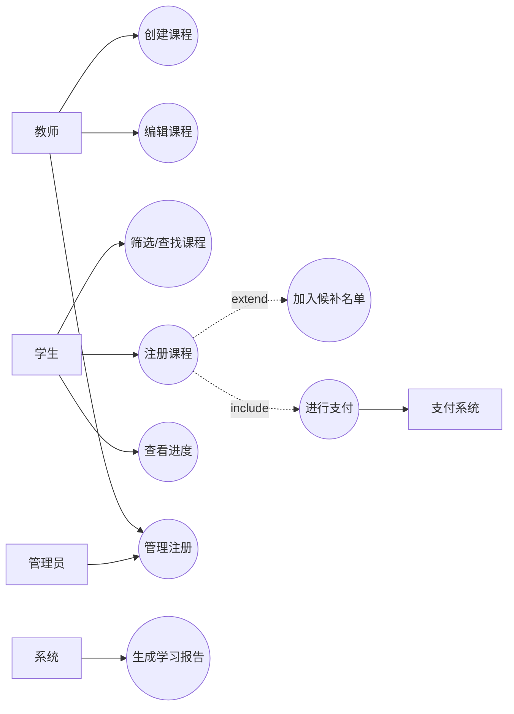
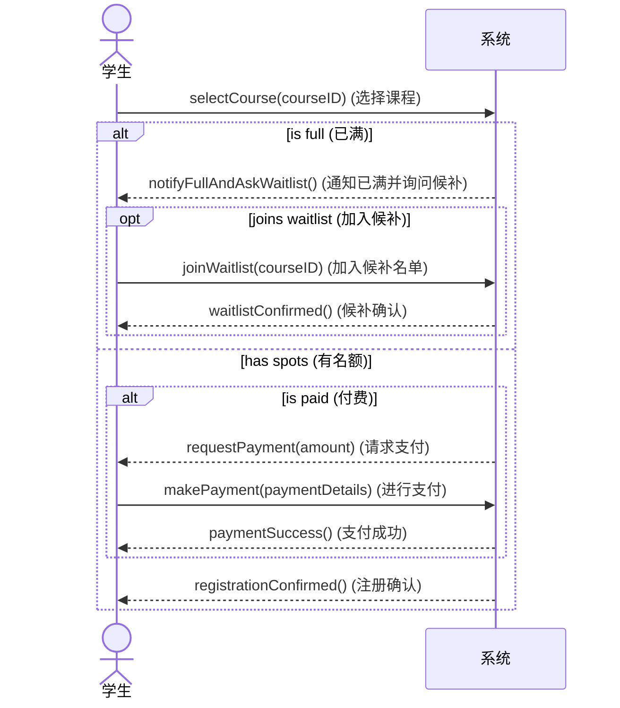
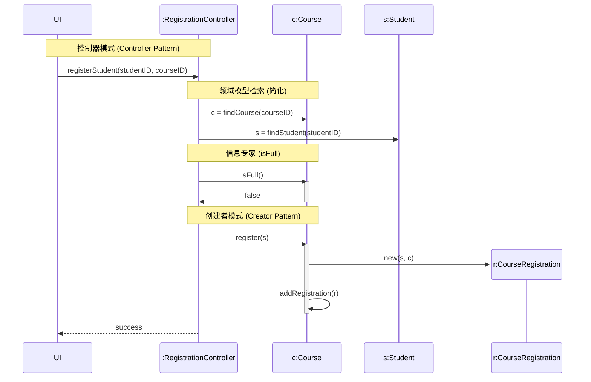
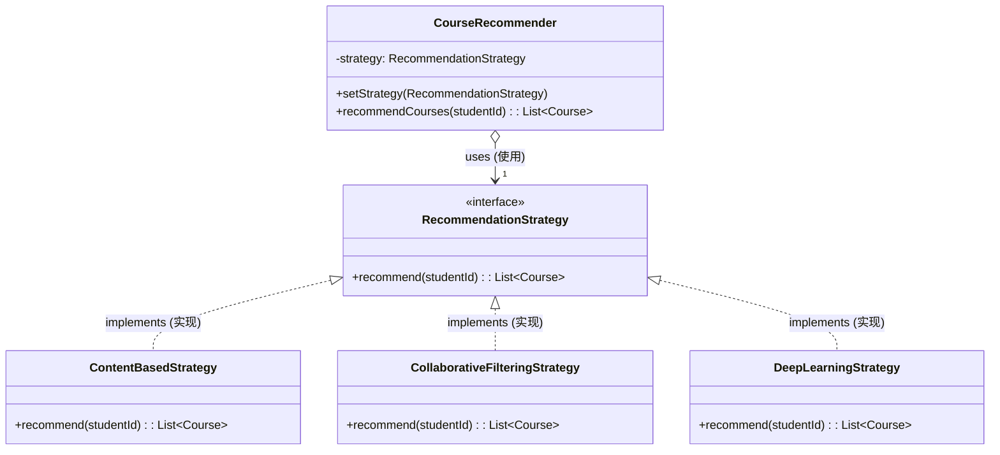

# 软件工程作业

## 1. 领域模型 (Domain Model) (10 分)

**概念:**
领域模型捕捉了在线教育平台环境中的重要概念类、它们的属性以及它们之间的关联。

**识别出的概念类:**
- **User (用户)** (抽象类), **Student (学生)**, **Teacher (教师)**, **Administrator (管理员)**
- **Course (课程)** (抽象类), **VideoCourse (视频课程)**, **GraphicCourse (图文课程)**, **LiveBroadcastCourse (直播课程)**
- **CourseRegistration (课程注册)**, **WaitlistEntry (候补名单记录)**
- **Payment (支付)**
- **LearningReport (学习报告)**, **LearningProgress (学习进度)**

**Mermaid 领域模型图:**

---

## 2. 用例模型 (Use Case Model) (15 分)

**用例图:**

**用例描述: 注册课程 (Register for Course)**

| 字段        | 描述                                                                                                                                                                                                                                                                                                                                |
| --------- | --------------------------------------------------------------------------------------------------------------------------------------------------------------------------------------------------------------------------------------------------------------------------------------------------------------------------------- |
| **用例名称**  | 注册课程                                                                                                                                                                                                                                                                                                                              |
| **主要参与者** | 学生                                                                                                                                                                                                                                                                                                                                |
| **利益相关者** | 学生, 教师, 支付系统                                                                                                                                                                                                                                                                                                                      |
| **前置条件**  | 学生已登录。课程存在且开放注册。                                                                                                                                                                                                                                                                                                                  |
| **后置条件**  | 学生已注册该课程，或已被加入候补名单。                                                                                                                                                                                                                                                                                                               |
| **主成功场景** | 1. 学生选择一门特定课程进行注册。 2. 系统验证课程可用性且名额未满。 3. 系统确定该课程为免费课程。 4. 系统将学生注册到该课程。 5. 系统创建课程注册记录。 6. 系统通知学生注册成功。                                                                                                                                                                                                               |
| **备选场景**  | **2a. 课程已满:** &nbsp;&nbsp;1. 系统通知学生名额已满。 &nbsp;&nbsp;2. 学生选择加入候补名单。 &nbsp;&nbsp;3. 系统将学生加入候补名单。 &nbsp;&nbsp;4. 用例结束。  **3a. 课程为付费课程:** &nbsp;&nbsp;1. 系统提示进行支付 (微信支付, 支付宝, 银行卡)。 &nbsp;&nbsp;2. 学生提供支付详情。 &nbsp;&nbsp;3. 系统通过外部支付系统验证支付。 &nbsp;&nbsp;4. 支付成功。 &nbsp;&nbsp;5. 系统注册学生 (回到主场景步骤 4)。 |

---

## 3. SSD 和操作契约 (SSD and Operation Contract) (10 分)

**系统顺序图 (SSD) - "注册课程":**

**操作契约: `registerStudent`**

*注意: 识别系统操作 `registerStudent`，该操作概念上发生在支付后或直接选择后。*

| 字段       | 内容                                                                                                                                                                           |
| -------- | ---------------------------------------------------------------------------------------------------------------------------------------------------------------------------- |
| **操作**   | `registerStudent(studentID, courseID)`                                                                                                                                       |
| **交叉引用** | 用例: 注册课程                                                                                                                                                                     |
| **前置条件** | - `Student` (学生) 存在。 - `Course` (课程) 存在。 - `Student` 尚未注册该 `Course`。                                                                                                   |
| **后置条件** | - 创建了一个新的 `CourseRegistration` (课程注册) 实例 `r`。 - `r.student` 被关联到 `Student`。 - `r.course` 被关联到 `Course`。 - `r.status` 变为 "Registered" (已注册)。 - `r.date` 被设置为当前日期。 |

---

## 4. GRASP 模式 (GRASP Patterns) (15 分)

**场景:** 学生注册课程 (为简化图表，忽略支付环节，专注于对象创建和职责分配)。

**使用的模式:**
1.  **控制器 (Controller):** `RegistrationController` 处理系统事件。
2.  **信息专家 (Information Expert):** `Course` 知道自己是否已满。
3.  **创建者 (Creator):** `Course` 创建 `CourseRegistration`，因为它聚合了注册记录 (或者 `Student` 也可以，但通常 `Course` 管理其名单是常见的领域选择)。
4.  **低耦合 (Low Coupling):** 使用控制器防止 UI 直接与领域对象耦合。

**交互图:**

---

## 5. GoF 模式 (GoF Patterns) (20 分)

**需求:**
系统需要根据业务场景灵活切换不同的推荐算法 (基于内容、协同过滤、深度学习)。

**选择的模式:** **策略模式 (Strategy Pattern)**
- **上下文 (Context):** `RecommendationService` (或 `CourseRecommender`)
- **策略接口 (Strategy Interface):** `RecommendationStrategy`
- **具体策略 (Concrete Strategies):** `ContentBasedStrategy`, `CollaborativeFilteringStrategy`, `DeepLearningStrategy`

**类图:**

**解释:**
**策略模式** 在这里非常理想，因为它定义了一族算法 (推荐逻辑)，分别封装起来，并使它们可以互换。`CourseRecommender` (上下文) 不需要知道推荐是如何生成的具体细节。它只需要持有 `RecommendationStrategy` 接口的引用。这允许系统在运行时 (例如通过配置或用户偏好) 更改推荐算法，而无需修改客户端代码，符合开闭原则 (Open/Closed Principle)。
