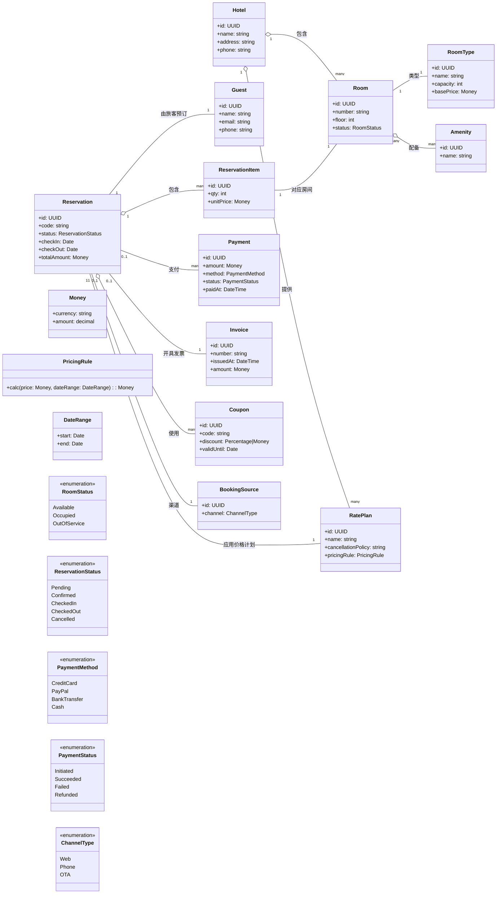
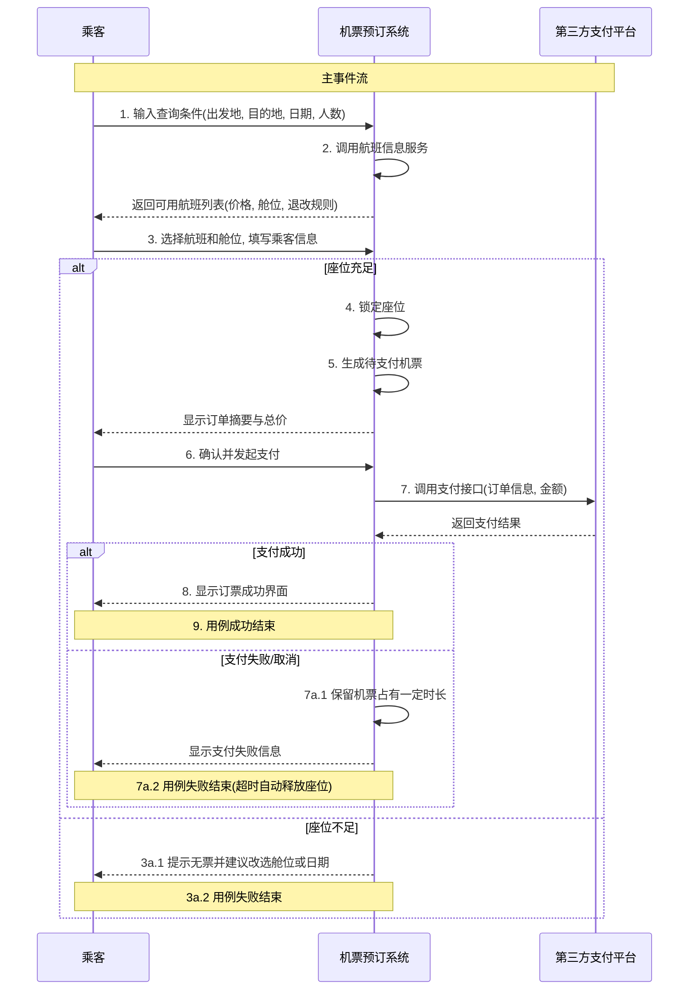

# 酒店预约系统领域模型

下图为核心领域模型，采用 Mermaid 类图表示，包含主要实体、值对象与关系。

关键约束与说明：
- 一次预约 `Reservation` 可以包含多间房，通过 `ReservationItem` 关联具体 `Room` 与数量。
- 定价由 `RatePlan` 与 `PricingRule` 决定，可叠加 `Coupon` 折扣，最终生成 `Invoice` 并记录 `Payment`。
- 可用性依赖 `Room.status` 与预约时间区间 `DateRange`，取消规则在 `RatePlan.cancellationPolicy`。
- 渠道来源 `BookingSource` 区分官网、电话及第三方 OTA。

---

# 预定机票用例系统顺序图

## 用例描述
**用例名：** 预订机票  
**主要参与者：** 订票人，第三方支付平台  
**简要描述：** 乘客完成从查询到支付的购票流程，系统生成有效电子票并关联乘客与航班。

## 系统顺序图 (SSD)

下图展示了预定机票用例的主要事件流，包括乘客与系统的交互以及系统与第三方支付平台的交互。

## 关键系统事件说明

1. **输入查询条件** - 乘客向系统提供搜索参数
2. **返回航班列表** - 系统响应查询并返回可用选项
3. **选择航班和填写信息** - 乘客做出选择并提供必要信息
4. **锁定座位** - 系统预留选定座位
5. **生成订单** - 系统创建待支付的机票订单
6. **发起支付** - 乘客确认订单并启动支付流程
7. **处理支付** - 系统与第三方支付平台交互
8. **显示结果** - 系统向乘客反馈最终状态

## 异常流程处理

- **座位不足 (3a)：** 系统检测到库存不足时，提供替代建议
- **支付失败 (7a)：** 系统实施座位保留机制，防止立即释放，给用户重试机会