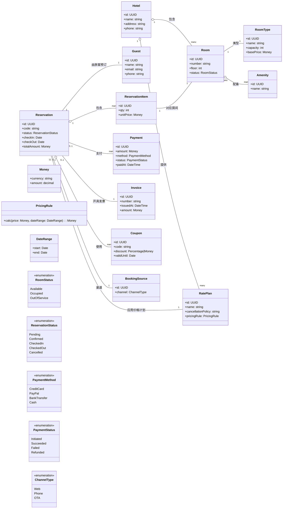

# 酒店预约系统领域模型

下图为核心领域模型，采用 Mermaid 类图表示，包含主要实体、值对象与关系。

关键约束与说明：
- 一次预约 `Reservation` 可以包含多间房，通过 `ReservationItem` 关联具体 `Room` 与数量。
- 定价由 `RatePlan` 与 `PricingRule` 决定，可叠加 `Coupon` 折扣，最终生成 `Invoice` 并记录 `Payment`。
- 可用性依赖 `Room.status` 与预约时间区间 `DateRange`，取消规则在 `RatePlan.cancellationPolicy`。
- 渠道来源 `BookingSource` 区分官网、电话及第三方 OTA。