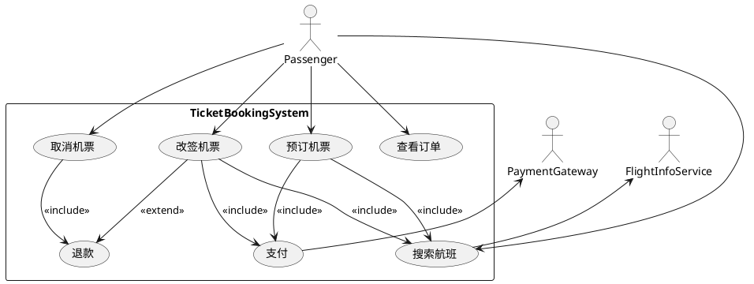

# 飞机票预定系统：用例图构造与“订票”用例描述

## 用例图构造
- 系统边界：`TicketBookingSystem`
- 参与者（Actors）：
  - `乘客`（主要参与者）：搜索航班、订票、改签、取消、查看订单
  - `航班信息服务`（外部系统）：提供航班信息查询
  - `支付平台`（外部系统）：完成支付与差价结算
- 主要用例：
  - `搜索航班`
  - `预订机票`
  - `支付`
  - `取消机票`
  - `退款`
  - `改签机票`
  - `查看订单`
- 关系设计：
  - `预订机票` <<include>> `搜索航班`
  - `预订机票` <<include>> `支付`
  - `取消机票` <<include>> `退款`
  - `改签机票` <<include>> `搜索航班`
  - `改签机票` <<include>> `支付`（当需补差价）
  - `改签机票` <<extend>> `退款`（当产生退差价或规则允许）
  - `搜索航班` ——— `航班信息服务`
  - `支付` ——— `支付平台`

可视化（PlantUML）：

## 用例描述：预订机票（订票）
- 用例名：预订机票
- 范围：`TicketBookingSystem`
- 级别：用户目标级
- 主要参与者：乘客
- 相关参与者：航班信息服务、支付平台
- 价值与目标：乘客完成从查询到支付的购票流程，系统生成有效`ticket`并关联`Passenger`与`Flight`。
- 前置条件：
  - 乘客已可访问系统（可选：已登录/注册）。
  - 航班信息服务可用，系统可检索航班。
- 成功后置条件：
  - 系统创建`ticket`（含`ticketId`、`flightId`、`passengerId`）。
  - 支付完成，生成`payment`记录并与`ticket`绑定。
  - 乘客可在订单中查看并下载电子票。
- 触发器：乘客选择“预订/购买”某航班。

### 基本流程（主成功场景）
1. 乘客输入出发地、目的地、日期、人数等条件。
2. 系统调用`航班信息服务`返回可用`Flight`列表与价格、舱位、退改规则。
3. 乘客筛选并选择目标航班与舱位，填写乘客信息。
4. 系统进行座位锁定与规则校验（库存、年龄/婴儿票、行李政策等）。
5. 系统生成待支付的`ticket`草案并展示订单摘要与总价。
6. 乘客确认后发起支付。
7. 系统调用`支付平台`完成扣款并接收支付结果。
8. 支付成功：系统固化`ticket`为正式订单，生成`payment`记录；发送确认通知。
9. 乘客在`查看订单`中查看电子票与行程信息。

### 备选与异常流程
- 2a. 航班信息服务不可用/超时：系统提示稍后重试或更换日期；流程中止。
- 4a. 座位不足：系统提示无票并建议改选舱位或日期。
- 6a. 价格变化：系统刷新价格，提示差异，乘客可继续或取消。
- 7a. 支付失败/取消：系统保留`ticket`草案一定时长并可重试；超时自动释放座位。
- 8a. 支付成功但出票失败：系统回滚出票并触发自动退款或人工处理。

### 业务规则与约束
- 价格、退改规则与库存以`航班信息服务`返回为准；若变化需二次确认。
- 支付仅在锁定时限内有效；逾期自动取消草案并释放座位。
- 一个`ticket`绑定一个`Passenger`与一个`Flight`；多乘客按多票处理。

### 数据与日志
- 关键实体：`Passenger(id,name)`、`Flight(flightId,origin,destination,number)`、`Ticket(ticketId,flightId,passengerId)`、`Payment(amount,ticketId)`。
- 日志：查询条件、选择结果、支付回执、异常原因，便于审计与售后。

### 非功能需求要点
- 可用性：查询与支付接口超时与重试策略。
- 安全性：支付与个人信息加密传输；最小化存储敏感数据。
- 可追踪性：订单状态机（草案→待支付→已支付→已出票）。