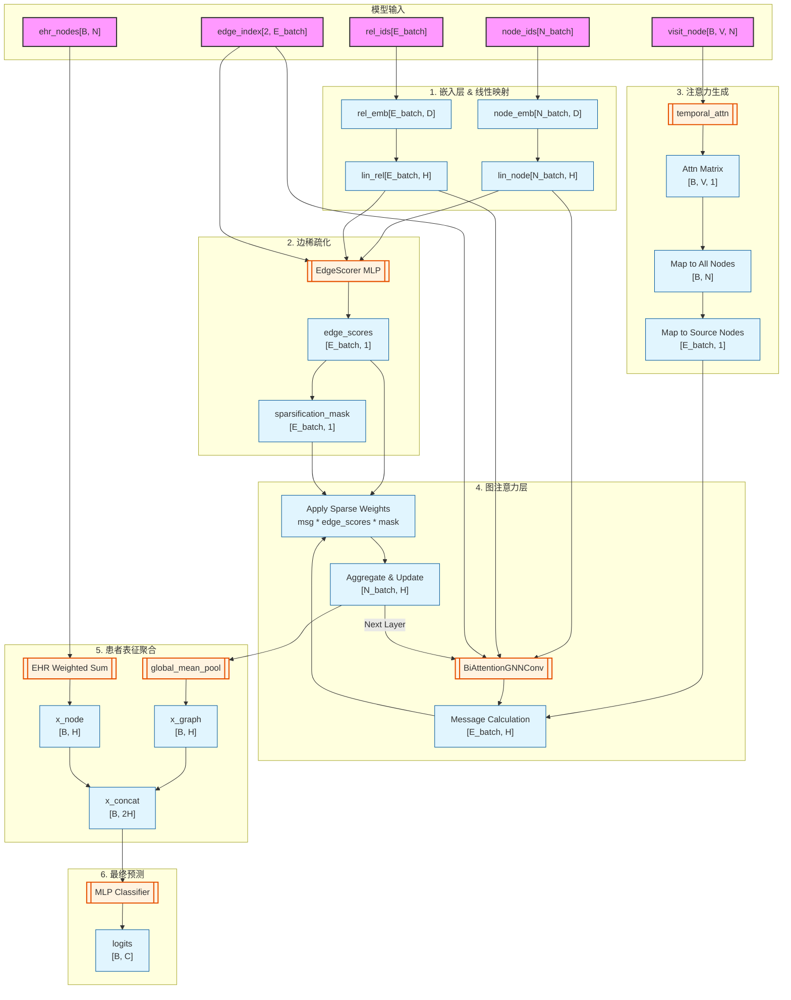

# 架构图：SparseGraphCare 模型架构与数据流

> **整合自**: 架构图2.md（SparseGraphCare 架构）、架构图.md（肺炎检测模块，非本项目核心，仅保留参考）
>
> 本文件基于 `SparseModel.py` 的源码实现以及 `runSparseModel.py` 中的模型调用参数，详细解析 SparseGraphCare 模型内部各层的数据维度处理及数据转移过程。

## 1. 维度符号定义

| 符号 | 代码参数 | 说明 |
|------|----------|------|
| $B$ | `batch_size` | 当前 batch 中的样本（病人）数量 |
| $N_{batch}$ | — | 当前 batch 中所有图节点的总数（PyG 批处理拼接） |
| $E_{batch}$ | — | 当前 batch 中所有图边的总数 |
| $N$ | `num_nodes` | 全局图中的节点总数 |
| $V$ | `max_visit` | 患者的最大就诊次数 |
| $D$ | `embedding_dim` | 初始节点/边嵌入的特征维度 |
| $H$ | `hidden_dim` | 隐藏层特征维度（默认 128） |
| $C$ | `out_channels` | 最终预测输出的类别或目标维度 |

## 2. 模型输入

在 `forward` 方法中接收以下核心张量：

1. **`node_ids`**: `[N_batch]` — 节点 ID 索引
2. **`rel_ids`**: `[E_batch]` — 边的关系 ID 索引
3. **`edge_index`**: `[2, E_batch]` — 图的拓扑连接结构
4. **`batch`**: `[N_batch]` — 指示每个节点属于哪位患者
5. **`visit_node`**: `[B, V, N]` — 患者在 $V$ 次就诊中对 $N$ 个节点的访问特征
6. **`ehr_nodes`**: `[B, N]` — 患者的聚合 EHR 节点特征

## 3. 维度转换流程

### 3.1 嵌入层与线性映射

```
node_emb(node_ids) → [N_batch, D] → lin_node → [N_batch, H]
rel_emb(rel_ids)   → [E_batch, D] → lin_rel  → [E_batch, H]
```

### 3.2 边稀疏化模块（EdgeScorer）

若开启 `use_sparsification=True`：

```
拼接特征: concat(src_nodes, tgt_nodes, edge) → [E_batch, 3H]
打分:     EdgeScorer(combined) → [E_batch, 1]  (Sigmoid, 值域 [0,1])
Top-K:    根据 sparsification_ratio 计算阈值 → sparsification_mask [E_batch, 1]
```

### 3.3 注意力机制生成

```
Alpha Attention:  alpha_attn(visit_node) → [B, V, N] → softmax(dim=1)
Beta Attention:   beta_attn(visit_node)  → [B, V, 1] → tanh × lambda_j
合并:            alpha * beta → [B, V, N] → sum(dim=1) → [B, N]
映射到边:        attn[xj_batch, xj_node_ids] → [E_batch, 1]
```

### 3.4 图神经网络卷积层（BAT）

共进行 `layers=3` 次消息传递：

```
Message:       msg = (x_j * attn + w_rel * edge_attr).relu() → [E_batch, H]
稀疏化门控:    msg = msg * (edge_scores * sparsification_mask) → [E_batch, H]
Aggregation:  add 池化 → [N_batch, H]
Update:       out + (1 + eps) * x_r → Linear → [N_batch, H]
层后处理:      ReLU + Dropout(0.5) → [N_batch, H]
```

### 3.5 患者表征聚合

`patient_mode="joint"` 模式下：

```
Graph-level:  global_mean_pool(x, batch) → [B, H]
Node-level:   ehr_nodes @ node_emb.weight / sum → [B, H]
Concat:       cat(x_graph, x_node) → [B, 2H]
```

### 3.6 最终预测

```
MLP(x_concat) → [B, C]
```

## 4. 模型架构图（Mermaid）



## 5. 边稀疏化的梯度处理

### 核心问题

`>= thresh` 和 `.float()` 的离散化操作在 PyTorch 中不可微，梯度在 Hard Mask 处会断掉。

### 解决方案：掩码乘法 + 辅助 Loss

**前向传播（保留的边）**：
```python
edge_weights_input = edge_scores * sparsification_mask  # mask 为常数 1/0
```
被保留的边（Mask=1）梯度可通过 `edge_scores` 回传给 EdgeScorer。

**被丢弃的边（Mask=0）**：
引入辅助稀疏化损失 `sparsification_loss`：

- **L1 稀疏性惩罚**：`l1_loss = mean(edge_scores)`，全局压低所有边得分
- **连通性保持惩罚**：`connectivity_loss = mean(relu(min_threshold - edge_counts))`，保证每个节点至少保留一定边权重

```python
# SparseModel.py 中的 compute_sparsification_loss
def compute_sparsification_loss(self, edge_scores, edge_index):
    l1_loss = torch.mean(edge_scores)
    edge_counts = torch.zeros(num_nodes).scatter_add_(0, edge_index[0], edge_scores.squeeze())
    connectivity_loss = torch.mean(torch.relu(1.0 - edge_counts))
    return self.l1_lambda * l1_loss + self.connectivity_lambda * connectivity_loss
```

> 即使一条边当前被 Mask 掉，仍能收到来自连通性辅助 Loss 的梯度。若后续 Epoch 主任务需要该节点，辅助 Loss 会推高其 `edge_scores`，超过阈值后在下次前向传播中被 Top-K 重新"复活"。

## 6. 附：肺炎检测模块架构（非 ICU 项目核心）

> `架构图.md` 原始内容为基于 Gemini API 的肺炎检测模块架构，采用适配器模式（Adapter Pattern），与 ICU 项目无直接关联。完整内容保留在 `_drafts/17-架构图-肺炎检测模块.md` 中供参考。

### 模块概述

- `ViTModelWrapper`：封装远程 API 调用为本地模型接口
- `GeminiClient`：封装 Google GenAI SDK
- `Config`：API Key、Prompt 等静态配置
