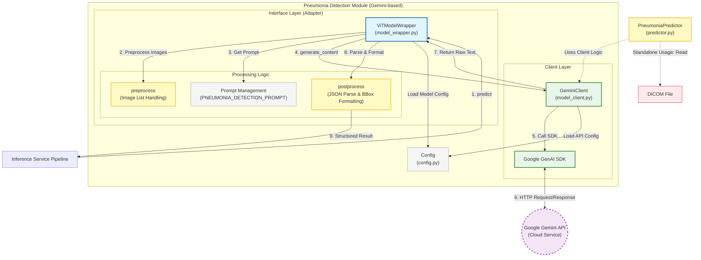
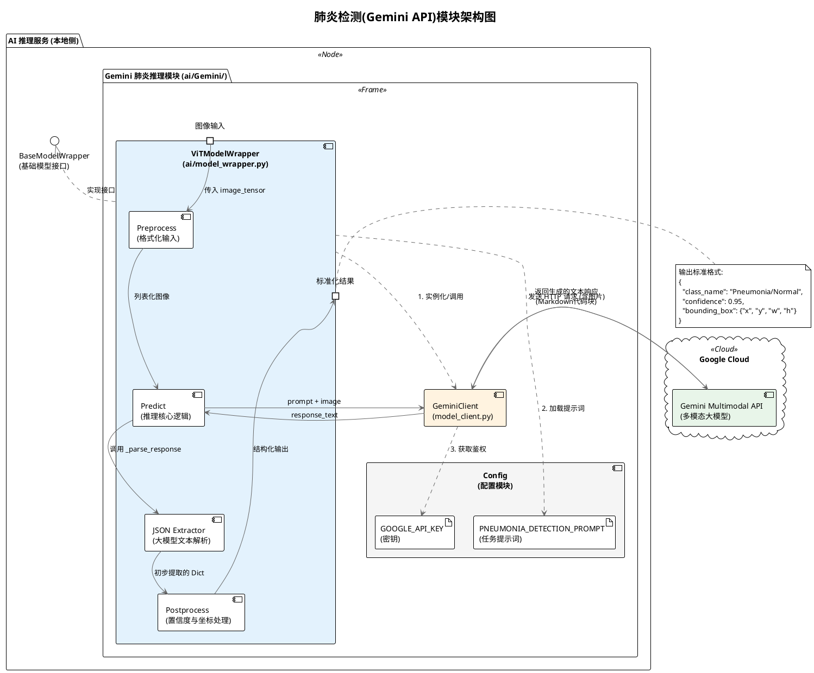

这是一个为您设计的 **Gemini 肺炎检测模块架构图**。

根据您提供的代码文件，这个模块采用了 **适配器模式 (Adapter Pattern)**：通过 `ViTModelWrapper` 将远程 API 调用封装成符合本地模型接口标准的类，使得上层推理服务无需感知它是远程调用还是本地模型。

我为您准备了 **Mermaid** 格式的架构图代码，您可以直接复制到飞书文档的 Mermaid 代码块中生成图表。

### 模块架构设计说明

该模块主要分为三层：
1.  **接口适配层 (`ViTModelWrapper`)**：
    *   **职责**：实现标准模型接口 (`load_model`, `predict`, `postprocess`)。
    *   **核心逻辑**：负责提示词 (Prompt) 管理、响应结果的 JSON 提取与清洗、以及将非结构化的 LLM 响应转换为结构化的检测结果 (Bounding Boxes)。
2.  **客户端层 (`GeminiClient`)**：
    *   **职责**：封装 Google GenAI SDK，处理鉴权和网络请求。
    *   **独立性**：这一层只负责“发”和“收”，不关心具体的业务逻辑（如肺炎检测），保持了通用性。
3.  **配置与工具层 (`config.py`, `predictor.py`)**：
    *   提供 API Key、Prompt 等静态配置。
    *   `predictor.py` 作为独立的 DICOM 预测入口（虽然 Wrapper 中重写了部分逻辑，但在模块视图中属于功能组件）。

---

### 架构图 (Mermaid 代码)

请在飞书中插入 **Mermaid** 块并粘贴以下代码：

### 架构解读

1.  **统一接口**：图中最上方的 `ViTModelWrapper` 是核心。它对外伪装成一个普通的本地模型，对内则协调 API 调用。这解释了为什么您可以在推理服务中像调用本地 AI 模型一样调用它。
2.  **数据流向**：
    *   **输入**：Pillow Image 对象（由上层服务传入）。
    *   **处理**：Wrapper 组装 Prompt + Image -> Client 发送请求 -> Gemini 返回自然语言文本。
    *   **输出**：Wrapper 内部的 `_parse_response` 方法解析 Markdown JSON，提取 `has_pneumonia` 和 `boxes`，最终标准化为包含 `class_name`, `confidence`, `bounding_box` 的字典列表。
3.  **容错设计**：您代码中的 `try-except` 块在 `postprocess` 逻辑中非常重要（图中体现为 `JSON Parse & Format`），确保了即使大模型返回格式不仅如人意，系统也不会崩溃，而是返回默认的“正常”结果。

希望这张图能帮助您清晰地在飞书中展示该模块的设计！

