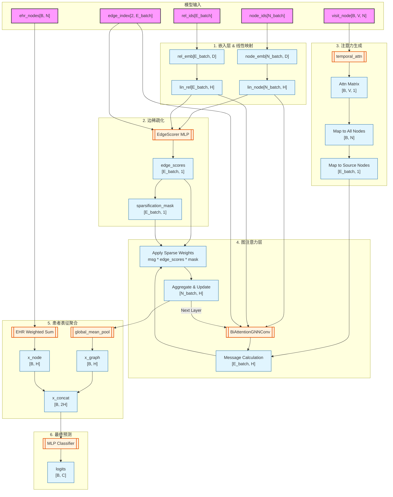

# SparseGraphCare 模型架构与数据流向分析 (Data Flow)

本文档基于 `SparseModel.py` 的源码实现以及 `runSparseModel.py` 中的模型调用参数，详细解析 `SparseGraphCare` 模型内部各层对数据的维度处理及数据转移过程。

## 1. 维度符号定义与初始化参数

根据 `runSparseModel.py`，模型的主要超参数和对应的维度符号如下：
*   **$B$**: `batch_size`，即当前 batch 中包含的样本（病人）数量。
*   **$N_{batch}$**: 当前 batch 中所有图节点的总数。在 PyG 批处理机制中，多张图会被拼接为一张大图。
*   **$E_{batch}$**: 当前 batch 中所有图边的总数。
*   **$N$**: `num_nodes`，全局图中的节点总数。
*   **$V$**: `max_visit`，患者的最大就诊次数。
*   **$D$**: `embedding_dim`，初始节点/边嵌入的特征维度。
*   **$H$**: `hidden_dim`，隐藏层特征维度（代码中默认为 128）。
*   **$C$**: `out_channels`，最终预测输出的类别或目标维度。

## 2. 模型输入 (Inputs)
在 `forward` 方法中，接收以下核心张量输入：
1.  **`node_ids`**: 形状为 `[N_batch]`。节点 ID 索引。
2.  **`rel_ids`**: 形状为 `[E_batch]`。边的关系 ID 索引。
3.  **`edge_index`**: 形状为 `[2, E_batch]`。定义图的拓扑连接结构。
4.  **`batch`**: 形状为 `[N_batch]`。指示每个节点属于 batch 中的哪一个图（即属于哪位患者）。
5.  **`visit_node`**: 形状为 `[B, V, N]`。记录患者 $B$ 在 $V$ 次就诊中对 $N$ 个节点的访问特征。
6.  **`ehr_nodes`**: 形状为 `[B, N]`。患者的聚合 EHR 节点特征。

---

## 3. 维度转换流程详解 (Layer-by-Layer Data Flow)

### 3.1 嵌入层与线性映射 (Embedding & Linear Transformation)
首先将离散的 IDs 映射为连续向量，并投影到统一的隐藏维度。
*   **节点嵌入**: 
    *   `x = node_emb(node_ids)` $\rightarrow$ `[N_batch, D]`
    *   `x = lin_node(x)` $\rightarrow$ `[N_batch, H]`
*   **关系嵌入**: 
    *   `edge_attr = rel_emb(rel_ids)` $\rightarrow$ `[E_batch, D]`
    *   `edge_attr = lin_rel(edge_attr)` $\rightarrow$ `[E_batch, H]`

### 3.2 边稀疏化模块 (Sparsification / EdgeScorer)
*若开启 `use_sparsification=True`*
*   **特征拼接**: 从源节点、目标节点及边本身提取特征拼接。
    *   `src_nodes` 和 `tgt_nodes` $\rightarrow$ `[E_batch, H]`
    *   `combined_features` = concat(src, tgt, edge) $\rightarrow$ `[E_batch, 3H]`
*   **打分机制**:
    *   `edge_scores = EdgeScorer(combined_features)` $\rightarrow$ `[E_batch, 1]`。每个值在 [0,1] 之间。
*   **Top-K 掩码**:
    *   根据 `sparsification_ratio` (如 0.1) 计算阈值，生成 `sparsification_mask` $\rightarrow$ `[E_batch, 1]`，其中保留的边为 1，丢弃的边为 0。

### 3.3 注意力机制生成 (Attention Generation)
每一层 GNN 前，基于患者历史就诊特征 (`visit_node`) 计算 Alpha / Beta 注意力。
*   **Alpha Attention** (节点级别):
    *   `alpha_attn(visit_node)` $\rightarrow$ `[B, V, N]`
    *   经过 softmax 归一化 $\rightarrow$ `[B, V, N]`
*   **Beta Attention** (就诊级别):
    *   `beta_attn(visit_node)` $\rightarrow$ `[B, V, 1]`
    *   应用 tanh 及衰减权重 (`lambda_j`) $\rightarrow$ `[B, V, 1]`
*   **合并与映射到边 (Attn Combined & Mapped)**:
    *   两者相乘后，在 $V$ 维度上求和 (`sum(dim=1)`) $\rightarrow$ `[B, N]`。
    *   根据 `edge_index[0]` 提取源节点对应的注意力权重 `attn_edges` $\rightarrow$ `[E_batch, 1]`。

### 3.4 图神经网络卷积层 (GNN Convolution - BAT)
共进行 `layers` 次消息传递（如 `layers=3`），输入为上层的 `x`。
*   **消息计算 (Message)**: 
    *   `msg = (x_j * attn_edges + w_rel * edge_attr).relu()` $\rightarrow$ `[E_batch, H]`。
    *   `w_rel` 也是从 `edge_attr` 经过线性层生成的 `[E_batch, 1]` 权重。
*   **稀疏化门控 (Sparsification Weighting)**:
    *   将消息乘以由 EdgeScorer 计算得到的权重及掩码: `msg = msg * (edge_scores * sparsification_mask)` $\rightarrow$ `[E_batch, H]`。
*   **消息聚合与状态更新 (Aggregation & Update)**:
    *   聚合 (`add` 池化) 目标节点的所有传入消息 $\rightarrow$ `[N_batch, H]`。
    *   加入跳跃连接 (`out + (1 + eps) * x_r`) 和线性变换 $\rightarrow$ `[N_batch, H]`。
*   **层后处理**: 经过 ReLU 激活和 Dropout (p=0.5)，`x` 的维度保持 `[N_batch, H]`。

### 3.5 患者表征聚合 (Patient Representation Aggregation)
针对 `patient_mode="joint"`，分别提取图级别和节点级别特征。
*   **Graph-level (全局图池化)**:
    *   `x_graph = global_mean_pool(x, batch)` $\rightarrow$ `[B, H]`。
*   **Node-level (基于 EHR 聚合)**:
    *   计算每个患者的特征: `ehr_nodes[i]`(`[N]`) @ `node_emb.weight`(`[N, D]`) $\rightarrow$ `[1, D]`。
    *   堆叠 B 个患者后得到 `[B, 1, D]`，再通过 `lin_node` 并压缩 $\rightarrow$ `[B, H]`。
*   **特征拼接 (Concat)**:
    *   `x_concat = torch.cat((x_graph, x_node), dim=1)` $\rightarrow$ `[B, 2H]`。

### 3.6 最终预测分类层 (Final Prediction / MLP)
*   **MLP 输出**:
    *   `logits = MLP(x_concat)` $\rightarrow$ `[B, C]`，输出针对每位患者的最终预测。

---

## 4. 模型架构图 (Mermaid)

