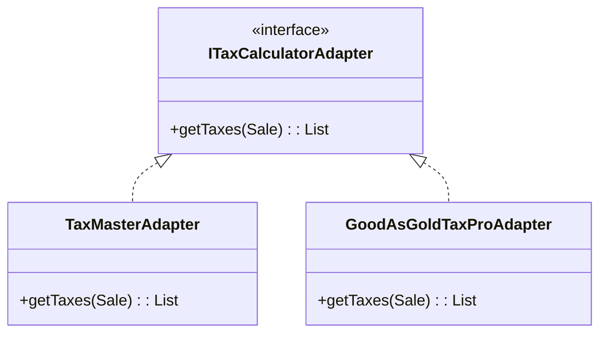
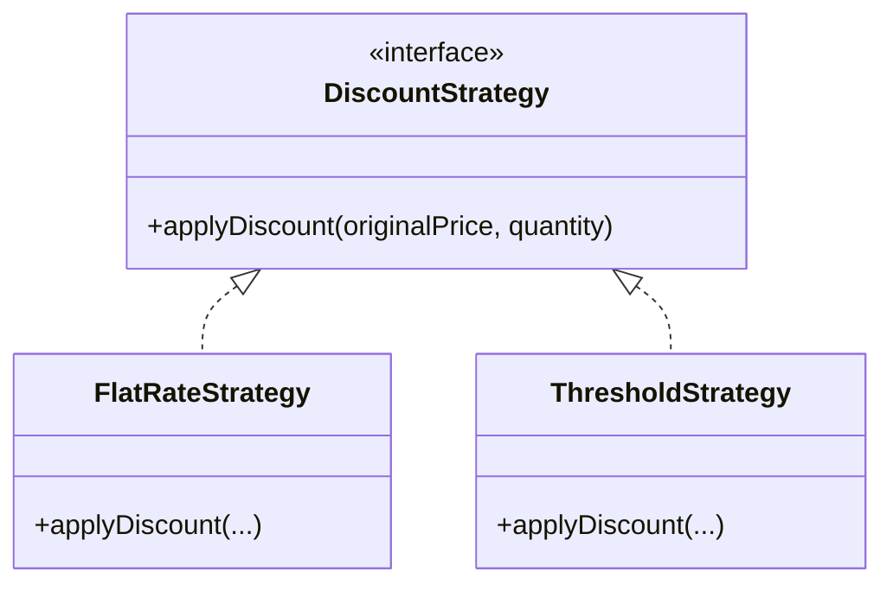
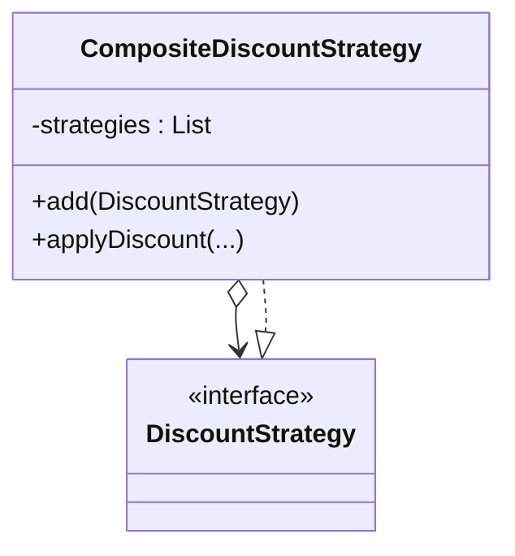
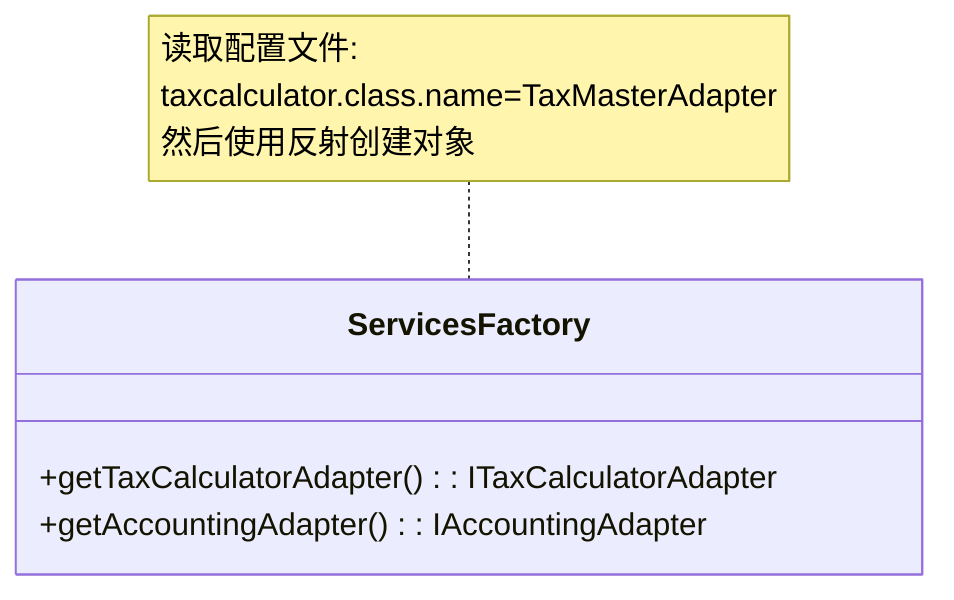
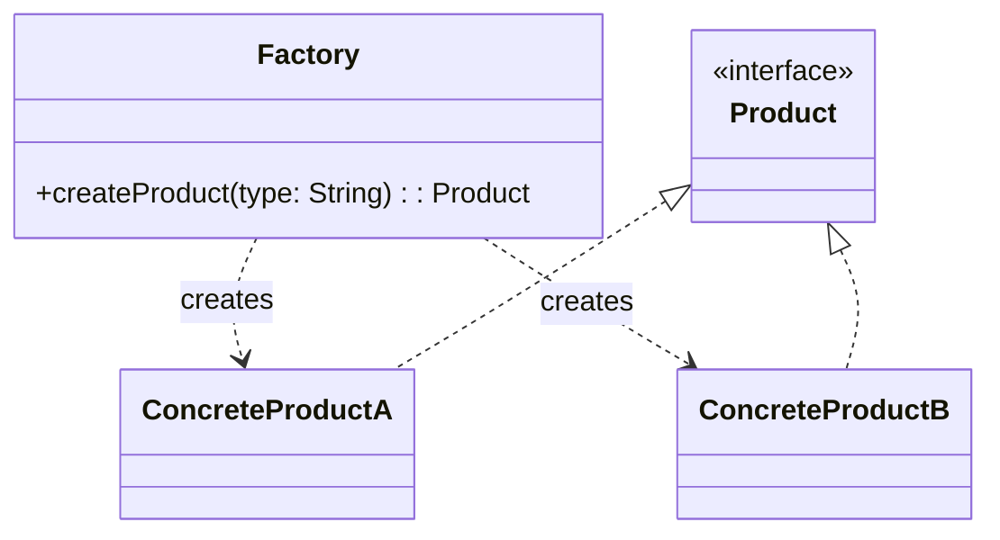
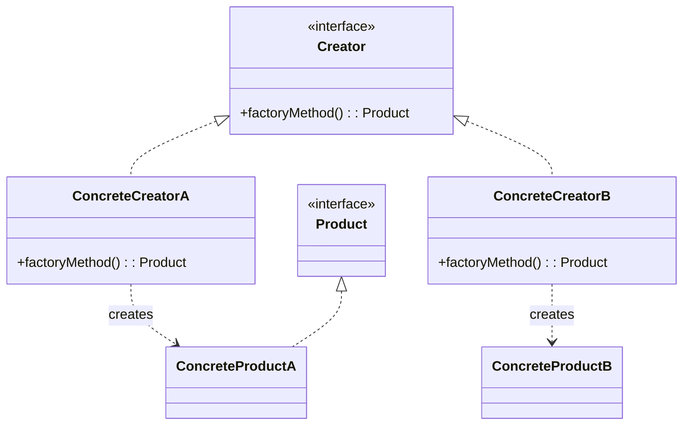

Gang of Four Design Patterns
> 23种经典的设计模式，分为创建型、结构型、行为型三类。

## 1. 适配器 (Adapter)
> 如何解决接口不兼容的问题？或者如何为具有不同接口的类似组件提供稳定的接口？
>: 通过一个中间的适配器对象，将原有的接口转换为另一个接口。

### 核心思想
- **中间层**: 增加一个间接层来适配变化的API。
- **多态**: 客户端只依赖统一的接口。
- **保护**: 保护系统不受外部接口变化的影响（Protected Variations）。

### 示例: NextGen POS 税务计算
系统需要对接多种第三方税务计算服务（TaxMaster, GoodAsGold 等），它们的API各不相同。

> [!TIP] 命名惯例
> 在类型名称中包含模式名称是一个好习惯。
> 例如：`SAPAccountingAdapter`, `TaxMasterAdapter`。
> 这样阅读代码的人一眼就能看出设计意图。

### 相关模式
- **Facade (外观模式)**: 也是为了隐藏子系统的复杂性。但 Facade 侧重于简化接口（把一堆复杂的调用变成一个简单的调用），而 Adapter 侧重于**转化**接口（把一个不兼容的变成兼容的）。

## 2. 策略 (Strategy)
> 如何处理一组相关的算法（如不同的定价规则），使它们可以灵活互换？
>: 定义一系列算法，把它们封装起来，并且使它们可互换。

### 核心思想
- **封装变化**: 把变化的算法从使用它的类中分离出来。
- **组合优于继承**: 通过组合（持有Strategy对象）而不是继承来实现行为变化。

### 示例: 灵活的打折方案

## 3. 组合 (Composite)
> 如何像处理单个对象一样一致地处理对象组合？
>: 将对象组合成树形结构以表示“部分-整体”的层次结构。

### 核心思想
- **一致性**: 客户端不需要区分是处理单个对象还是处理一堆对象。
- **递归**: 组合对象内部遍历调用子对象。

### 示例: 叠加多种折扣

## 4. 工厂 (Factory)
> 谁负责创建**复杂的对象**（如适配器或策略）？
>: 定义一个用于创建对象的接口，让子类决定实例化哪一个类。

### 核心思想
- **分离关注点 (Separation of Concerns)**: 将“复杂的创建逻辑”与“业务逻辑”分离开。
- **纯虚构 (Pure Fabrication)**: 工厂类通常不是领域概念，而是为了保持高内聚而创造的辅助类。
- **数据驱动设计 (Data-Driven Design)**: 可以从配置文件读取类名，动态加载类，无需修改代码即可切换实现。

### 示例: ServicesFactory
我们有了 `ITaxCalculatorAdapter` 和具体的适配器，但谁来 `new` 它们呢？
如果让 `Register` (收银台) 去 `new TaxMasterAdapter()`，`Register` 就和 `TaxMaster` 耦合了，违反了低耦合原则。

**解决方案**: 创建一个 `ServicesFactory`

### 4.1 简单工厂 (Simple Factory)
> 这是一个具体的类，不是 GoF 的 23 种模式之一，但使用极其广泛。

#### 核心思想
由一个工厂类根据传入的参数（如字符串），动态决定创建哪一个产品类的实例。

#### 优缺点
- **优点**: 客户端免除了创建对象的责任，实现了责任分割。
- **缺点**: 
    - **违反 OCP (开放-封闭原则)**: 一旦添加新产品（如 ProductC），就必须修改工厂类的 `if-else` 或 `switch` 逻辑。
    - **全责风险**: 工厂类集中了所有创建逻辑，一旦出错，整个系统受影响。

---

### 4.2 工厂方法 (Factory Method)
> GoF 23 种模式之一。
> 定义一个用于创建对象的接口，让子类决定实例化哪一个类。

#### 核心思想
将“创建对象的职责”下放给子类。基类（或接口）只定义创建的标准，不负责具体创建。

#### 优缺点
- **优点**: 
    - **符合 OCP**: 增加新产品时，只需增加一个新的 Factory 子类，不需要修改原有代码。
    - **高内聚**: 每个 Factory 只负责一种产品的创建。
- **缺点**: 
    - **类爆炸**: 每增加一个产品，就需要增加一个对应的 Factory 类，增加了开发量和系统复杂度。

---

### 4.3 最佳实践：结合反射 (Reflection)
如前文的 `ServicesFactory` 所示，在 .NET/Java 中，我们通常使用 **简单工厂 + 配置文件 + 反射**。
- 既避免了简单工厂的 `switch-case` (OCP 问题)。
- 又避免了工厂方法的类爆炸。
- **Data-Driven Design**: 真正的灵活之道。

### 为什么用 Factory？
1. **隐藏复杂性**: 创建逻辑可能很复杂（读取配置、反射、缓存实例），工厂把这些脏活累活都藏起来了。
2. **高内聚**: 业务对象只管业务，工厂对象只管创建，各司其职。
3. **易于切换**: 配合配置文件，改一行字就能换掉整个系统的税务服务，连代码都不用重新编译。

## 5. GoF 与 GRASP 的关系
>GRASP 是“原理”，GoF 是“应用”。

很多 GoF 模式其实是多个 GRASP 原则的**具体组合应用**。

### 以 Adapter 为例
Adapter 模式本质上使用了以下 GRASP 原则：

1.  **Indirection (间接性)**: 引入了一个中间对象（Adapter），打断了 Client 和 ExternalService 的直接联系。
2.  **Polymorphism (多态)**: 为不同的 ExternalService 提供了统一的接口。
3.  **Pure Fabrication (纯虚构)**: Adapter 不是领域模型中的概念，而是为了设计而创造出来的类。

**最终目的**：
实现 **Protected Variations (受保护变化)** 和 **Low Coupling (低耦合)**。
