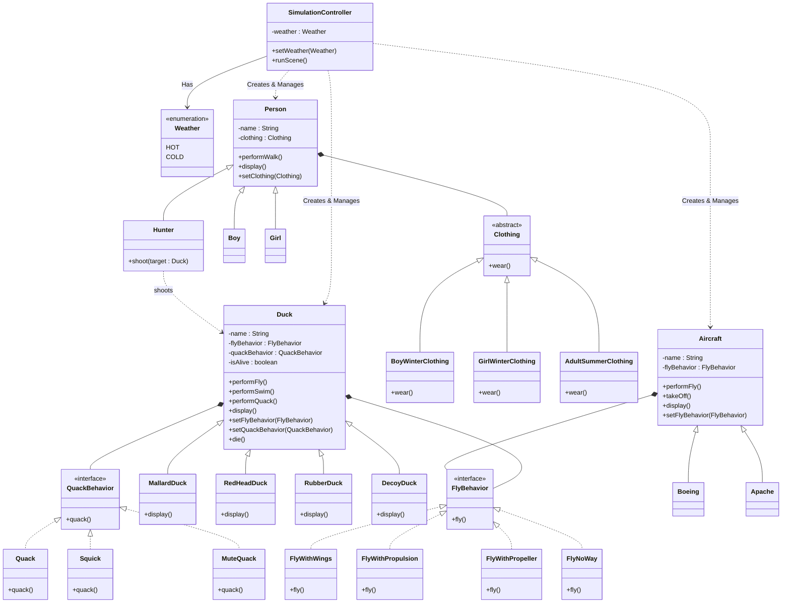

## GRASP 设计原则应用说明 & 修改点解释

1.  **控制器 (Controller) 与 状态管理**
    *   **修改点**: `SimulationController` 现在拥有 `weather` 属性，并提供 `setWeather(Weather)` 和 `runScene()` 方法。
    *   **体现**: 控制器不再通过不同的方法（`runHotScene`/`runColdScene`）来区分场景，而是通过内部状态（`Weather`）来决定 `runScene()` 的具体逻辑。这降低了控制器的接口复杂度，使其更具内聚性。

2.  **枚举类 (Enumeration)**
    *   **修改点**: 新增 `Weather` 枚举类，包含 `HOT` 和 `COLD`。
    *   **体现**: 使用枚举类型显式定义系统支持的环境状态，提高了代码的可读性和类型安全性。

3.  **多态 (Polymorphism) & 策略扩展**
    *   `MoveBehavior` 体系支持多种移动方式，包括 `FlyWithPropulsion` (喷气动力) 和 `FlyWithPropeller` (螺旋桨)。
    *   **新增**: `StopOnGround` 类实现 `MoveBehavior` 接口，专门用于处理“停在地上”的行为逻辑，这与 `FlyNoWay` (可能表示完全无法飞行) 有语义上的区别，更精确地描述了飞机在地面静止的状态。

4.  **低表示差距 (Low Representational Gap)**
    *   方法命名（`performFly`, `performWalk`, `takeOff` 等）保持了与现实概念的一致性。

5.  **封装 (Encapsulation)**
    *   `Aircraft` 的 `takeOff()` 和 `display()` 方法封装了其特有的行为逻辑。
    *   **新增**: `performStopOnGround()` 方法被添加到 `Aircraft` 类中，用于执行“停在地上”的行为，其内部实现通常是委托给 `StopOnGround` 策略。
