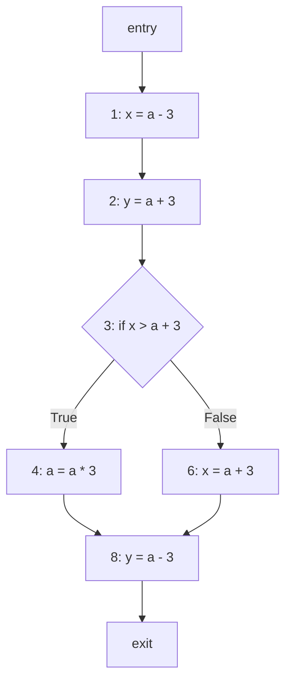

# Lab 6 习题解答

## 1.1 控制流图 (Control-Flow Graph) [8 分]

**节点 (Nodes)**:
CFG 包含以下 8 个节点（语句）：
*   Entry
*   1: `x = a - 3`
*   2: `y = a + 3`
*   3: `if x > a + 3`
*   4: `a = a * 3`
*   6: `x = a + 3`
*   8: `y = a - 3`
*   Exit

**边 (Edges)**:
总共有 8 条边：
*   Entry -> 1
*   1 -> 2
*   2 -> 3
*   3 -> 4 (True 分支)
*   3 -> 6 (False 分支)
*   4 -> 8
*   6 -> 8
*   8 -> Exit

**Mermaid 图示**:

**检查**:
节点数 (8) + 边数 (8) = 16。符合题目要求。

## 1.2 传递函数 (Transfer Function) [10 分]

**非平凡算术表达式**:
涉及运算符 +, -, * 的表达式有：
1.  $a - 3$
2.  $a + 3$
3.  $a * 3$

*(注: `x > a + 3` 包含 `a + 3`)*

**Gen 和 Kill 集合**:

| 语句 (Statements)  | $gen(s)$    | $kill(s)$                 |
| :----------------- | :---------- | :------------------------ |
| 1 (`x = a - 3`)    | $\{a - 3\}$ | $\emptyset$               |
| 2 (`y = a + 3`)    | $\{a + 3\}$ | $\emptyset$               |
| 3 (`if x > a + 3`) | $\{a + 3\}$ | $\emptyset$               |
| 4 (`a = a * 3`)    | $\emptyset$ | $\{a - 3, a + 3, a * 3\}$ |
| 6 (`x = a + 3`)    | $\{a + 3\}$ | $\emptyset$               |
| 8 (`y = a - 3`)    | $\{a - 3\}$ | $\emptyset$               |

## 1.3 求解数据流方程 (Solving Data Flow Equations) [16 分]

我们使用迭代算法进行可用表达式分析（前向分析）。
*   **定义域 (Domain)**: $\{a - 3, a + 3, a * 3\}$
*   **传递方程**: $AE_{exit}(s) = gen(s) \cup (AE_{entry}(s) - kill(s))$
*   **汇合运算 (Confluence Operator)**: 交集 ($\cap$)
*   **初始化**: $AE_{entry}(entry) = \emptyset$，其他所有集合初始化为全集。

**最终结果**:

| 语句 (Statements) | $AE_{entry}(s)$    | $AE_{exit}(s)$     |
| :---------------- | :----------------- | :----------------- |
| 1                 | $\emptyset$        | $\{a - 3\}$        |
| 2                 | $\{a - 3\}$        | $\{a - 3, a + 3\}$ |
| 3                 | $\{a - 3, a + 3\}$ | $\{a - 3, a + 3\}$ |
| 4                 | $\{a - 3, a + 3\}$ | $\emptyset$        |
| 6                 | $\{a - 3, a + 3\}$ | $\{a - 3, a + 3\}$ |
| 8                 | $\emptyset$        | $\{a - 3\}$        |

## 1.4 理解 (Understanding) [4 分]

**编译器如何利用可用表达式分析的结果来优化原始程序？**

编译器可以利用这些结果执行 **公共子表达式消除 (Common Subexpression Elimination, CSE)**。通过识别某个表达式（如 `a + 3`) 在特定点（例如语句 3 和 6）是可用的，编译器可以避免重新计算它。相反，它可以计算一次该值（例如在语句 2），将其存储在一个临时变量中，并在之后重用该变量，从而减少算术运算的次数。
