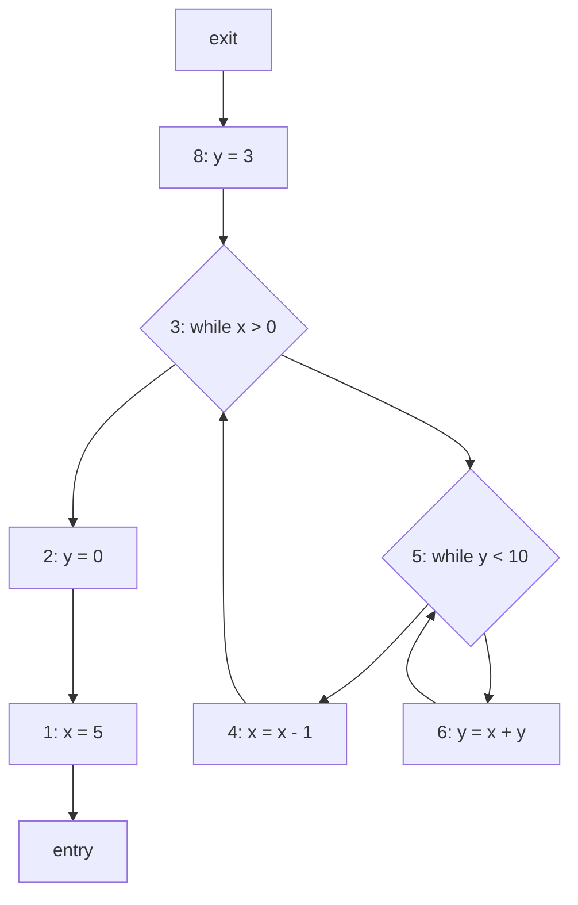

# Lab 6 习题解答 (Problem 2)

## 2. Live Variables [38 points]

**Program Code**:
```python
1   x = 5
2   y = 0
3   while x > 0:
4       x = x - 1
5       while y < 10:
6           y = x + y
7   end
8   y = 3
```

### 2.1 Reversed Control-Flow Graph [8 points]

**节点 (Nodes)**:
CFG 包含以下 7 个节点（语句），不包含 `end`：
*   Entry
*   1: `x = 5`
*   2: `y = 0`
*   3: `while x > 0`
*   4: `x = x - 1`
*   5: `while y < 10`
*   6: `y = x + y`
*   8: `y = 3`
*   Exit

**反向边 (Reversed Edges)**:
原始 CFG 的边反转后：
*   1 -> Entry
*   2 -> 1
*   3 -> 2
*   3 -> 5 (Back edge from inner loop exit)
*   4 -> 3
*   5 -> 4
*   5 -> 6 (Back edge from inner loop body)
*   6 -> 5
*   8 -> 3
*   Exit -> 8

*(注意：在正向 CFG 中，5 (False) -> 3 (Outer Loop Header)，5 (True) -> 6。在反向图中，箭头方向相反)*

**Mermaid 图示 (Reversed CFG)**:



### 2.2 Transfer Function [10 points]

**Domain**: $\{x, y\}$

**Gen and Kill Sets**:

| 语句 (Statements) | $gen(s)$    | $kill(s)$   |
| :---------------- | :---------- | :---------- |
| 1 (`x = 5`)       | $\emptyset$ | $\{x\}$     |
| 2 (`y = 0`)       | $\emptyset$ | $\{y\}$     |
| 3 (`while x > 0`) | $\{x\}$     | $\emptyset$ |
| 4 (`x = x - 1`)   | $\{x\}$     | $\{x\}$     |
| 5 (`while y < 10`)| $\{y\}$     | $\emptyset$ |
| 6 (`y = x + y`)   | $\{x, y\}$  | $\{y\}$     |
| 8 (`y = 3`)       | $\emptyset$ | $\{y\}$     |

### 2.3 Solving Data Flow Equations [16 points]

我们使用迭代算法进行活跃变量分析（后向分析）。
*   **方程**: $LV_{entry}(s) = gen(s) \cup (LV_{exit}(s) - kill(s))$
*   **汇合**: $LV_{exit}(s) = \bigcup_{p \in succ(s)} LV_{entry}(p)$

| 语句 (Statements) | $LV_{entry}(s)$ | $LV_{exit}(s)$ |
| :---------------- | :-------------- | :------------- |
| 1                 | $\emptyset$     | $\{x\}$        |
| 2                 | $\{x\}$         | $\{x, y\}$     |
| 3                 | $\{x, y\}$      | $\{x, y\}$     |
| 4                 | $\{x, y\}$      | $\{x, y\}$     |
| 5                 | $\{x, y\}$      | $\{x, y\}$     |
| 6                 | $\{x, y\}$      | $\{x, y\}$     |
| 8                 | $\emptyset$     | $\emptyset$    |

*(注：语句 8 的 Exit 集合为空，因为它通向程序出口，且没有变量在出口处被使用。虽然 x 在语句 1-6 中活跃，但在语句 8 之后不再活跃)*

### 2.4 Understanding [4 points]

**How could a compiler use the results of Live Variables analysis to optimize the original program?**

编译器可以利用活跃变量分析的结果来进行 **死代码消除 (Dead Code Elimination)** 和 **寄存器分配 (Register Allocation)**。
例如，如果一个变量在定义后其 $LV_{exit}$ 集合不包含该变量（即该变量在之后从未被使用），那么该定义语句（如无副作用）可以被删除。在寄存器分配中，如果在某个程序点两个变量同时活跃（即都在 $LV$ 集合中），则它们不能被分配到同一个物理寄存器（干扰）。

