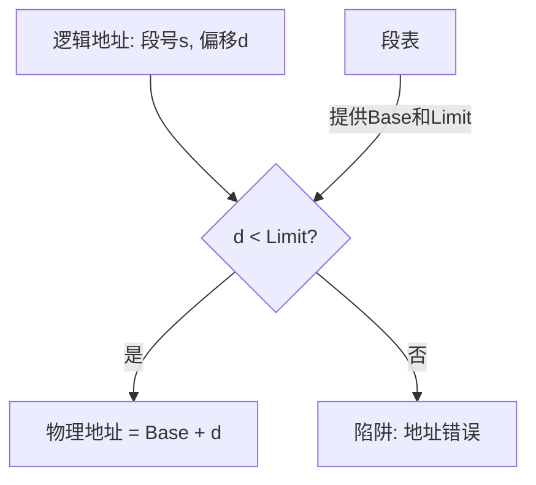

## 基本概念
分段是一种支持程序员视角的内存管理方案。程序的逻辑视图通常是由多个有意义的模块组成（如主程序、子程序、栈、符号表等），而不是一个线性的字节数组。每个模块称为一个**段 (Segment)**。

每个段都有一个名称（或段号）和一个长度。逻辑地址由两部分组成：
$$<段号 s, 段内偏移 d>$$

## 硬件与地址转换
与[[分页机制|分页]]类似，系统需要通过**段表 (Segment Table)** 将二维的用户定义地址映射到一维的物理地址。
段表的每个条目包含：
- **段基址 (Base)**：该段在物理内存中的起始地址。
- **段界限 (Limit)**：该段的长度。

### 地址转换流程
1. 提取逻辑地址中的段号 $s$ 和偏移量 $d$。
2. 使用段号 $s$ 作为段表的索引，找到对应的段基址和段界限。
3. 检查偏移量 $d$ 是否合法，即要求 $0 \le d < Limit$。若越界，则产生寻址错误陷阱。
4. 若合法，物理地址为 $Base + d$。

## 分段与分页的对比
- **碎片问题**：分段容易产生外部碎片，因为段的大小不一，在内存分配时类似[[连续内存分配|动态分区分配]]；而分页则产生内部碎片。
- **保护与共享**：分段在逻辑层面上进行保护（例如代码段只读，数据段可读写）和共享（共享一个完整的子程序段）更加自然，因为段具有明确的语义边界。

## 段页式内存管理
为了结合分段和分页的优点，许多现代处理器采用了**段页式 (Segmentation with Paging)** 内存管理。
逻辑地址首先通过分段机制映射为线性地址（或虚拟地址），然后通过分页机制将线性地址映射为物理地址。这种方法既提供了灵活的逻辑划分，又避免了严重的外部碎片。