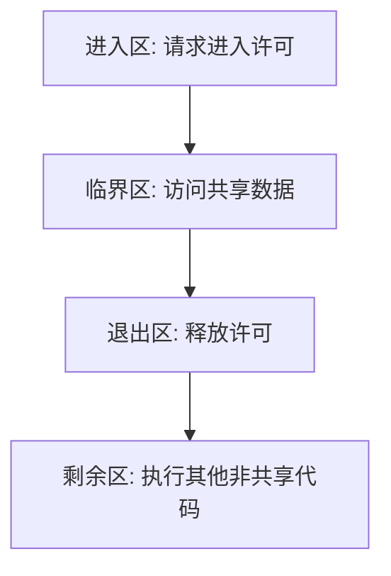

## 背景与概念
并发执行的进程可能需要共享数据。如果多个进程并发访问和操作同一数据，且执行结果取决于访问发生的特定顺序，则称之为**竞争条件**（Race Condition）。为了防止竞争条件，需要确保一段时间内只有一个进程能操作共享数据，这引出了进程同步的需求。

在每个进程中，包含访问共享数据代码的段称为**临界区**（Critical Section）。当一个进程在执行其临界区代码时，任何其他进程都不能在其临界区内执行。因此，进程在进入临界区前必须请求权限，实现这一请求的代码段称为**进入区**（Entry Section）。临界区之后可以有**退出区**（Exit Section），其余代码称为**剩余区**（Remainder Section）。

## 临界区问题的解决方案要求
一个解决临界区问题的有效方案必须满足以下三个要求：
1. **互斥**（Mutual Exclusion）：如果进程 $P_i$ 在其临界区内执行，则其他任何进程都不能在它们的临界区内执行。
2. **进步**（Progress）：如果没有进程在临界区内执行，且有进程希望进入临界区，则只有那些不在剩余区内执行的进程可以参与决定谁将下一个进入临界区，且这种选择不能被无限期推迟。
3. **有限等待**（Bounded Waiting）：从一个进程做出进入临界区的请求开始，到该请求被允许为止，其他进程被允许进入其临界区的次数必须有上限。

## 软件同步方法
### Peterson算法
Peterson算法是一个经典的基于软件的临界区问题解决方案，主要适用于两个进程在严格交替执行情况下的同步。该算法依赖于两个共享数据项：
- `int turn;`
- `boolean flag[2];`

变量 `turn` 表示哪个进程有权进入临界区。数组 `flag` 用于表示进程是否准备好进入临界区。如果 `flag[i] = true`，则说明进程 $P_i$ 准备好进入临界区。通常在实际系统开发中，更多使用[[互斥锁与信号量|互斥锁]]来实现更通用的同步。

虽然软件方法具有理论意义，但在现代计算机体系结构中，由于编译器和处理器的指令重排，像Peterson算法这样的纯软件解决方案可能无法正确工作，因此通常需要依赖硬件支持或操作系统提供的更高级抽象。在处理更复杂的[[经典同步问题|同步问题]]时，需要更加健壮的机制。
