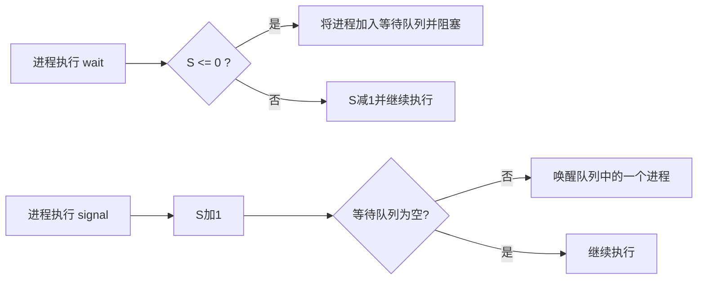

## 硬件同步基础
在探讨高级同步工具之前，需要了解底层的硬件支持。现代系统提供特殊的硬件指令（如 `test_and_set` 和 `compare_and_swap`）用于原子性地检查和修改字的内容。这些原子指令是实现更高级同步机制（如[[临界区问题|临界区]]的保护）的基础。

## 互斥锁 (Mutex Locks)
操作系统为应用程序提供的高级软件工具中，最简单的是**互斥锁**。一个进程在进入临界区之前必须获得锁，在退出临界区时释放锁。

互斥锁通常包含一个布尔变量，用于指示锁是否可用。互斥锁的主要操作包括：
- `acquire()`: 获取锁。如果锁不可用，调用该操作的进程将被阻塞或自旋。
- `release()`: 释放锁。

如果获取锁的过程是通过不断循环检查锁的状态来实现的，这种行为被称为**忙等待**（Busy Waiting）。采用忙等待机制的互斥锁被称为**自旋锁**（Spinlock）。

### 忙等待与阻塞的对比
- **忙等待（自旋锁）**：进程在等待锁可用时，会持续占用 CPU 执行空循环指令。其优点是**避免了进程上下文切换的开销**，因此非常适用于锁被持有时间极短的**多处理器系统**（一个线程在自旋，另一个线程在另一个 CPU 上释放锁）。但缺点是在单处理器系统或长耗时任务中会严重浪费 CPU 周期。
- **阻塞（睡眠锁）**：为了克服忙等待的缺点，如果锁不可用，进程可以选择**阻塞**（Block）自己。系统会将该进程放入等待队列，并触发上下文切换（由[[经典调度算法|调度程序]]介入），将 CPU 分配给其他就绪进程。当锁被释放时，该进程才会被唤醒。这种方式节约了 CPU 资源，但带来了上下文切换的开销，适用于锁持有时间较长的场景。

## 信号量 (Semaphores)
信号量是一种更为强健的同步工具，由一个整型变量 $S$ 表示。除了初始化外，只能通过两个标准的不可分割的[[原子操作]]来访问：`wait()` 和 `signal()`（也称为 $P$ 和 $V$ 操作）。

### 信号量的定义
`wait()` 操作的定义如下：
$$
\text{wait}(S) \{ \\
\quad \text{while} (S \le 0) \\
\quad \quad ; // \text{忙等待} \\
\quad S--; \\
\}
$$
表示进程**申请或消耗一个资源**。
如果资源数量 $S \le 0$，说明暂无可用资源，进程必须等待；如果 $S > 0$，则进程成功获取该资源，并将可用资源数减 $1$。

`signal()` 操作的定义如下：
$$
\text{signal}(S) \{ \\
\quad S++; \\
\}
$$
表示进程**释放或产生一个资源**。
操作执行后，将可用资源数 $S$ 增加 $1$。

### 信号量的分类
- **计数信号量**（Counting Semaphore）：其值可以是不受限制的域。通常用于控制对具有多个实例的某种资源的访问。信号量初始化为可用资源的数量。
- **二进制信号量**（Binary Semaphore）：其值只能是 $0$ 或 $1$。二进制信号量的行为类似于互斥锁，常用于在缺乏互斥锁支持的系统上提供互斥功能。

### 无忙等待的信号量实现
为了克服忙等待的缺点，可以修改信号量的操作。当一个进程执行 `wait()` 发现信号量不为正时，不进行忙等待，而是阻塞自己。阻塞操作将进程放入与该信号量相关的等待队列中，并将进程状态切换为等待状态。随后控制权转移给CPU调度程序，以选择另一个进程执行。

当其他进程执行 `signal()` 时，通过唤醒操作从等待队列中移除一个进程，并将其状态更改为就绪状态。

合理利用这些机制可以有效解决[[经典同步问题|复杂的并发挑战]]，同时也是避免和处理[[死锁特征与处理方法|死锁问题]]的关键基础。
