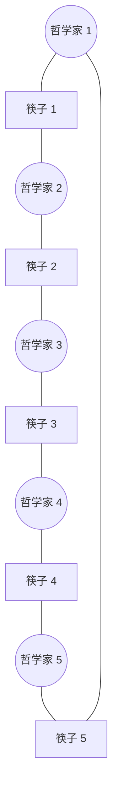

## 经典同步问题概述
在并发编程中，存在一些经典的同步问题，用于测试和验证各种同步方案（如[[互斥锁与信号量|信号量]]和管程）。这些问题抽象了现实系统中常见的并发访问模式，解决这些问题有助于深入理解[[临界区问题|临界区]]保护机制。

## 生产者-消费者问题 (有限缓冲问题)
问题描述：生产者进程生成数据并放入缓冲区，消费者进程从缓冲区取出数据并消费。缓冲区大小有限（设为 $N$）。

同步需求：
1. 当缓冲区满时，生产者必须等待。
2. 当缓冲区空时，消费者必须等待。
3. 对缓冲区的访问必须是互斥的。

解决方案通常使用三个信号量：
- `mutex`：初始化为 $1$，用于提供对缓冲池访问的互斥。
- `empty`：初始化为 $N$，表示空缓冲区的数量。
- `full`：初始化为 $0$，表示满缓冲区的数量。

## 读者-写者问题
问题描述：一个数据对象被多个并发进程共享。部分进程只要求读内容（读者），部分进程要求更新内容（写者）。
- 允许多个读者同时读。
- 写者必须独占访问权（即写者进行写操作时，不允许其他写者或读者访问）。

第一类读者-写者问题（读者优先）：除非写者已获得使用共享对象的权限，否则读者不应等待。
所需的共享数据结构包括互斥锁和信号量，用于追踪当前的读者数量并确保写者的互斥访问。该问题容易导致写者饥饿。

## 哲学家就餐问题
问题描述：五位哲学家围绕一张圆桌思考和进餐。桌上有五根筷子，每两位相邻哲学家之间有一根。哲学家进餐时需要同时拿起左右两边的两根筷子。

挑战在于如何分配筷子使得不会出现两人同时竞争同一根筷子导致系统停滞。如果所有哲学家同时拿起左边的筷子，则会引发[[死锁特征与处理方法|死锁]]。

常见的无死锁解决方案包括：
1. 最多允许四位哲学家同时坐在桌旁。
2. 仅当哲学家的左右两根筷子都可用时，才允许他拿起筷子。
3. 非对称解决方案：奇数号哲学家先拿左边筷子，偶数号哲学家先拿右边筷子。
