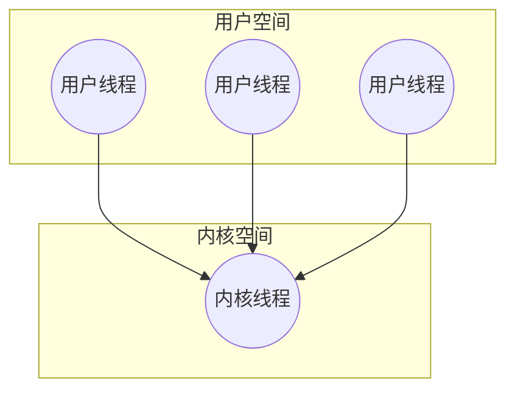
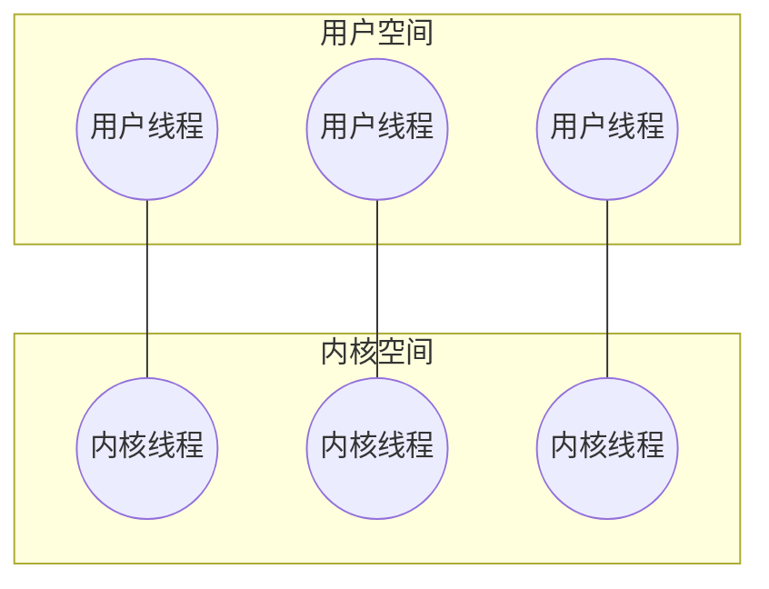
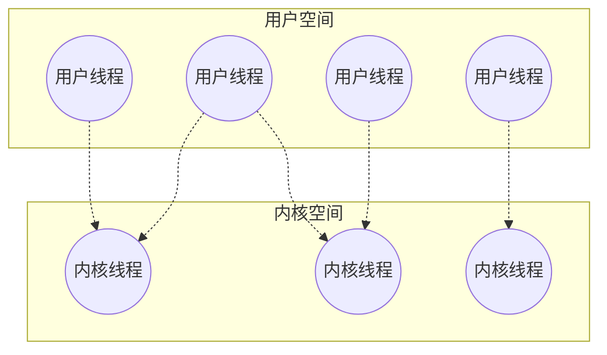

## 动机与优势

线程是CPU使用的基本单元，由线程ID、程序计数器、寄存器集合和栈组成。它与属于同一进程的其他线程共享代码段、数据段和其他操作系统资源（如打开文件和信号）。传统进程只包含一个控制线程。如果一个进程包含多个控制线程，那么它可以同时执行多个任务。现代操作系统通过引入多线程机制，为复杂的应用程序提供了高效的并发执行环境。在涉及[[调度准则与基础|进程调度]]时，实际调度的往往是内核级的线程。

多线程编程的优势可分为四大类：

1. **响应度高**：如果对交互式应用程序采用多线程，那么即使部分阻塞或执行冗长操作，该程序仍能继续执行，从而增加对用户的响应。
2. **资源共享**：线程默认共享它们所属进程的内存和资源。资源共享的优点在于允许一个应用程序在同一地址空间内有多个不同的活动线程。
3. **经济**：分配进程创建所需的内存和资源成本较高。由于线程能共享其所属进程的资源，所以创建和切换线程更经济。
4. **多处理器体系结构的利用**：多线程的优点之一是能充分利用多处理器体系结构。每个线程可以并行运行在不同的处理器上。

## 多线程模型

用户线程受用户级线程库支持，而内核线程受操作系统直接支持与管理。现代操作系统都支持内核线程。用户线程和内核线程之间存在三种建立关联的经典模型：

### 多对一模型

多对一模型将多个用户级线程映射到一个内核线程。

- **优点**：线程管理由用户空间的线程库完成，效率较高。
- **缺点**：如果一个线程执行阻塞系统调用，那么整个进程都会阻塞。此外，因为只有一个内核线程可以访问内核，所以多个线程不能并行运行在多核系统上。

### 一对一模型

一对一模型将每个用户线程映射到一个内核线程。

- **优点**：当一个线程执行阻塞系统调用时，允许另一个线程继续执行，因此提供了比多对一模型更好的并发功能；它也允许多个线程并行运行在多处理器系统上。
- **缺点**：创建用户线程需要创建一个相应的内核线程，这会增加开销并影响应用程序性能。大多数这种模型的实现限制了系统支持的线程数量。

### 多对多模型

多对多模型多路复用许多用户级线程到同样数量或更小数量的内核线程上。

- **特点**：结合了上述两种模型的优点。开发者可以创建任意多的用户线程，并且相应内核线程能在多处理器系统上并行执行。而且，当一个线程执行阻塞系统调用时，内核可以运用合适的[[经典调度算法|调度算法]]选择另一个线程执行。

## 隐式线程

随着多核处理器的普及和应用程序中线程数量的增加，将线程创建与管理的负担从应用程序开发人员转移给编译器和运行时库变得越来越流行。这种策略被称为隐式线程（Implicit Threading）。常见的方法包括：

- **线程池（Thread Pools）**：在进程启动时创建一定数量的线程，并放入池中等待工作。当服务器收到请求时，会唤醒池中的一个线程；如果池中没有可用线程，服务器将等待直到有可用线程为止。
- **OpenMP**：提供了一组编译器指令和API，用于C、C++和FORTRAN程序中的共享内存多线程编程。
- **Grand Central Dispatch (GCD)**：由苹果公司开发的用于macOS和iOS操作系统的技术，通过调度队列和线程池来管理并发执行的任务。