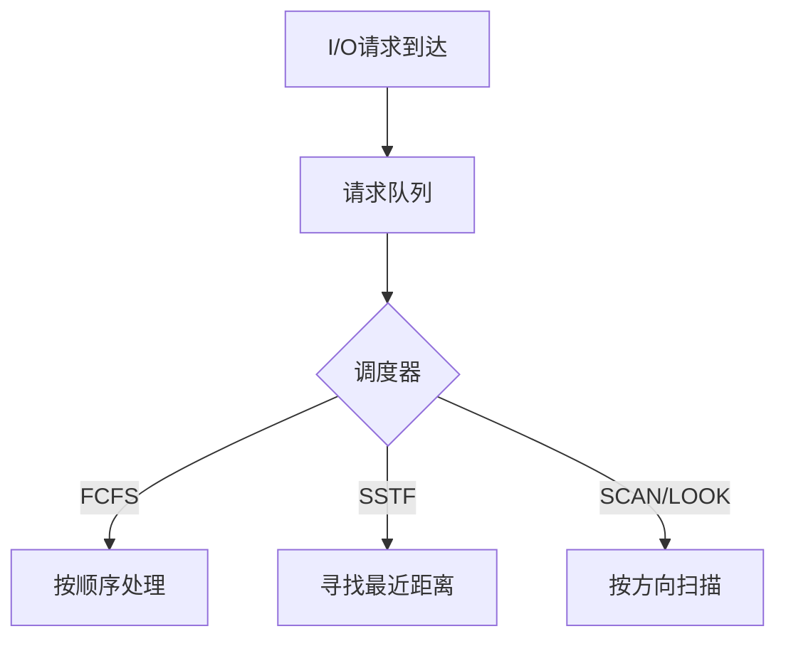

## 磁盘结构与调度目标

现代磁盘将数据存储在盘片上，通过磁头进行读写。磁盘调度的主要目标是最小化寻道时间，寻道时间与寻道距离成正比。调度请求通常由[[IO硬件与内核子系统#内核IO子系统|内核I/O子系统]]发出，并进入请求队列。

## 磁盘调度算法

### FCFS调度

先来先服务算法。
- **特点**：最简单的调度算法，公平但性能通常不佳。
- **示例流程**：
  假设请求队列为：$98, 183, 37, 122, 14, 124, 65, 67$，磁头初始位置在 $53$。
  移动顺序：$53 \rightarrow 98 \rightarrow 183 \rightarrow 37 \rightarrow 122 \rightarrow 14 \rightarrow 124 \rightarrow 65 \rightarrow 67$。
  总移动距离：$640$ 个柱面。

### SSTF调度

最短寻道时间优先。
- **特点**：选择距离当前磁头位置最近的请求，可能导致某些请求饥饿。
- **示例流程**：
  同上队列，初始位置 $53$。
  移动顺序：$53 \rightarrow 65 \rightarrow 67 \rightarrow 37 \rightarrow 14 \rightarrow 98 \rightarrow 122 \rightarrow 124 \rightarrow 183$。
  总移动距离：$236$ 个柱面。

### SCAN调度

电梯算法，磁头从磁盘一端向另一端移动，处理沿途的请求，到达一端后反向移动。
- **特点**：避免了饥饿现象，但在改变方向时两端的等待时间较长。
- **示例流程**：
  初始位置 $53$，假设向 $0$ 方向移动。
  移动顺序：$53 \rightarrow 37 \rightarrow 14 \rightarrow 0 \rightarrow 65 \rightarrow 67 \rightarrow 98 \rightarrow 122 \rightarrow 124 \rightarrow 183$。
  总移动距离：$236$ 个柱面。

### C-SCAN调度

循环扫描。磁头从一端移动到另一端处理请求，到达后立即返回起点，返回途中不处理任何请求。
- **特点**：提供更均匀的等待时间。
- **示例流程**：
  初始位置 $53$，向 $199$ 方向移动。
  移动顺序：$53 \rightarrow 65 \rightarrow 67 \rightarrow 98 \rightarrow 122 \rightarrow 124 \rightarrow 183 \rightarrow 199 \rightarrow 0 \rightarrow 14 \rightarrow 37$。

### LOOK与C-LOOK调度

SCAN和C-SCAN的变体，磁头只移动到最远的请求位置，而不是磁盘的尽头。
- **特点**：比标准SCAN和C-SCAN更高效。
- **示例流程**：
  采用C-LOOK时，初始位置 $53$，向大方向移动。
  移动顺序：$53 \rightarrow 65 \rightarrow 67 \rightarrow 98 \rightarrow 122 \rightarrow 124 \rightarrow 183 \rightarrow 14 \rightarrow 37$。

