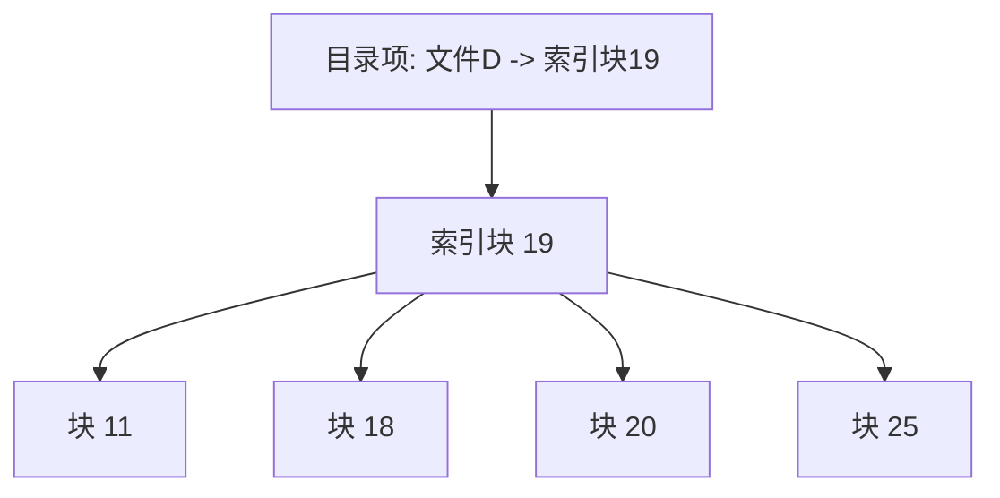

## 文件分配概述

在[[文件概念与目录结构|文件系统]]中，核心问题是如何为文件分配磁盘空间，以便有效利用磁盘并快速访问。主要分配方法包括连续分配、链接分配和索引分配。

## 连续分配

连续分配要求每个文件在磁盘上占有一组连续的块。
- **优点**：支持顺序访问和直接访问，寻道时间少，由于磁盘头移动减少，能够和[[磁盘调度算法#FCFS调度|简单的磁盘调度]]良好配合。
- **缺点**：存在外部碎片问题，文件大小不易动态扩展。

### 连续分配示例流程

假设文件A需要 $3$ 个块，文件B需要 $4$ 个块。磁盘块状态如下：
1. 文件A分配块 $10, 11, 12$。目录中记录起始块为 $10$，长度为 $3$。
2. 文件B分配块 $13, 14, 15, 16$。目录中记录起始块为 $13$，长度为 $4$。

## 链接分配

链接分配中，文件是磁盘块的链表。每个块包含指向下一个块的指针。
- **优点**：没有外部碎片，文件易于扩展。
- **缺点**：仅支持顺序访问，指针占用存储空间，可靠性较差。

### FAT文件分配表

一种变体的链接分配，将指针集中存放在内存中的FAT表中，从而支持直接访问并减少寻道次数。

### 链接分配示例流程

假设文件C分配了 $3$ 个块（块 $9$、块 $16$、块 $1$）。
1. 目录项记录文件C的起始块为 $9$。
2. 块 $9$ 的末尾包含指向块 $16$ 的指针。
3. 块 $16$ 的末尾包含指向块 $1$ 的指针。
4. 块 $1$ 的末尾标记为文件结束标记。

## 索引分配

把所有指针集中存放在索引块中。每个文件有自己的索引块，它是一个磁盘块地址的数组。
- **优点**：支持直接访问，无外部碎片。
- **缺点**：索引块本身会造成空间浪费，特别是对小文件而言。

### 索引分配示例流程

假设文件D包含 $4$ 个数据块，分配到块 $11, 18, 20, 25$。
1. 系统为文件D分配一个索引块（如块 $19$）。
2. 目录项指向块 $19$。
3. 块 $19$ 的内容依次为：$11, 18, 20, 25$。
4. 读文件D的第 $3$ 个块时，系统先读取块 $19$，找到第 $3$ 个地址 $20$，然后直接读取块 $20$。

