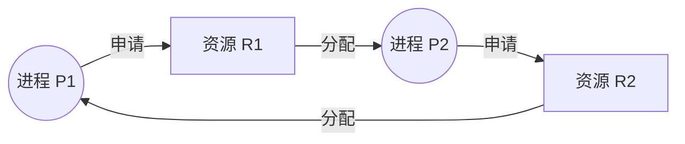

## 死锁的定义与背景
在多道程序环境中，多个进程可能竞争有限的系统资源。当一个进程申请资源而该资源不可用时，进程进入等待状态。如果所申请的资源被其他同样处于等待状态的进程占有，那么这些等待进程将永远无法改变状态，这种情况被称为**死锁**（Deadlock）。

死锁的发生通常与并发控制机制不当有关，特别是在处理复杂的[[经典同步问题|资源共享场景]]时，如果未能正确使用[[互斥锁与信号量|同步工具]]，极易导致系统陷入僵局。

## 死锁的四个必要条件
死锁的发生必须同时满足以下四个条件（Coffman条件）：

1. **互斥**（Mutual Exclusion）：至少有一个资源必须处于非共享模式，即一次只有一个进程可使用该资源。
2. **占有并等待**（Hold and Wait）：一个进程必须占有至少一个资源，并等待获取被其他进程占有的额外资源。
3. **非抢占**（No Preemption）：资源不能被抢占，即资源只能在占有它的进程完成任务后，由该进程自愿释放。
4. **循环等待**（Circular Wait）：存在一个等待进程的集合 $\{P_0, P_1, \dots, P_n\}$，使得 $P_0$ 正在等待 $P_1$ 占有的资源，$P_1$ 正在等待 $P_2$ 占有的资源，以此类推，最后 $P_n$ 正在等待 $P_0$ 占有的资源。

## 资源分配图
死锁可以通过称为**系统资源分配图**的有向图来精确描述。图中包含节点集合和边集合。
- 节点分为两类：进程集合 $P$ 和资源类型集合 $R$。
- 有向边 $P_i \rightarrow R_j$ 称为**申请边**，表示进程 $P_i$ 申请资源 $R_j$。
- 有向边 $R_j \rightarrow P_i$ 称为**分配边**，表示资源 $R_j$ 的一个实例已分配给进程 $P_i$。

在上述图中，存在一个环路，且资源实例有限，系统处于死锁状态。如果资源分配图中没有环路，则系统绝没有死锁。如果存在环路，则系统可能存在死锁。

## 死锁的处理方法
通常有三种处理死锁的策略：

1. **死锁预防与避免**：确保系统永远不会进入死锁状态。
	- **死锁预防**：通过限制资源请求，确保至少一个死锁必要条件不成立。例如，要求进程一次性请求所有资源（破坏占有并等待），或允许资源抢占（破坏非抢占）。
	- **死锁避免**：要求操作系统提前获得有关进程将申请的资源信息，并在每次分配时动态检查系统是否处于安全状态。著名的避免算法是[[银行家算法|银行家算法]]。
2. **死锁检测与恢复**：允许系统进入死锁状态，检测死锁的发生并采取措施恢复。恢复机制包括终止一个或多个死锁进程，或抢占某些死锁进程的资源。
3. **忽略死锁**：假装死锁从未发生。这是包括 Windows 和 Linux 在内的绝大多数操作系统采用的方法。因为死锁发生频率低且预防代价高，交由应用程序开发者处理更为经济。
