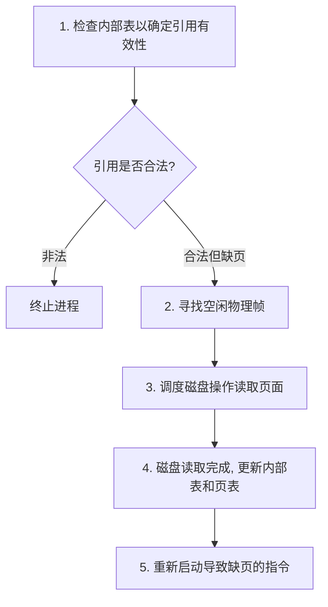

## 基本概念
虚拟内存的核心思想是将逻辑内存与物理内存分离，使得逻辑地址空间可以远大于物理内存。**按需调页 (Demand Paging)** 是实现虚拟内存最常见的方式。
在按需调页系统中，页面仅在程序执行期间需要时才被调入主存。那些从未被访问的页面永远不会被加载。这极大降低了内存需求，并允许更多的程序并发执行。它高度依赖于底层硬件的[[分页机制|分页]]支持。

## 缺页错误
当进程试图访问一个未在内存中的页面时（即页表项中的有效-无效位被标记为无效），硬件会触发一个**缺页错误 (Page Fault)** 陷阱。操作系统必须处理这个陷阱。

### 缺页处理流程

1. 检查进程的内部表（通常与 PCB 一起保存），判断该内存访问是合法的还是非法的。
2. 若非法，终止进程；若合法且页面不在内存中，则需将其调入。
3. 寻找一个空闲的物理帧。若没有空闲帧，则需要调用[[页面置换算法|特定页面置换算法]]。
4. 调度磁盘操作，将所需页面读入新分配的帧中。
5. 磁盘读取完成后，修改内部表和页表以表明该页面现在在内存中（有效位设为有效）。
6. 重新启动被中断的指令。

## 性能分析
按需调页对系统性能有显著影响。定义 $p$ 为缺页率 ($0 \le p \le 1$)。
- 若 $p = 0$，则没有缺页。
- 若 $p = 1$，则每次引用都缺页。

有效访问时间 (Effective Access Time, EAT) 计算如下：
$$EAT = (1 - p) \times 内存访问时间 + p \times 缺页错误处理时间$$
由于缺页错误处理涉及磁盘 I/O，其时间通常是内存访问时间的数万倍。因此，必须将缺页率 $p$ 保持在极低的水平，以避免系统性能急剧下降。

## 页面置换需求
在执行缺页处理的第3步时，如果发现物理内存已满，没有空闲帧，操作系统就必须选择一个当前在内存中的页面，将其写回磁盘（如果被修改过），并腾出空间给新页面。选择哪个页面被替换，将直接影响缺页率，这需要依靠高效的[[页面置换算法|置换算法]]来完成。