## 先到先服务调度（FCFS）

先到先服务（First-Come, First-Served, FCFS）是最简单的CPU调度算法。请求CPU的进程首先获得分配的CPU。它可以通过FIFO（先进先出）队列轻松实现。FCFS是一种非抢占式算法，一旦CPU分配给进程，该进程就会一直保持CPU直到释放它为止。

**实例说明**：
假设有三个进程 $P_1, P_2, P_3$，它们在时刻0依次到达，其CPU区间长度分别为24、3、3。
执行顺序的甘特图如下：

```mermaid
gantt
    title FCFS 调度甘特图
    dateFormat  s
    axisFormat  %S
    section 进程执行
    P1 :a1, 0, 24s
    P2 :a2, after a1, 3s
    P3 :a3, after a2, 3s
```

- **等待时间**：$P_1 = 0$, $P_2 = 24$, $P_3 = 27$。
- **平均等待时间**：$(0 + 24 + 27) / 3 = 17$。

如果进程的到达顺序改为 $P_2, P_3, P_1$，则 $P_2$ 先执行，等待时间变为 $(0 + 3 + 6) / 3 = 3$。这展示了**护航效应（Convoy Effect）**，即许多短进程等待一个长进程释放CPU，从而导致CPU和设备利用率降低。

## 最短作业优先调度（SJF）

最短作业优先（Shortest-Job-First, SJF）算法将每个进程与其下一个CPU区间的长度关联起来。当CPU空闲时，它会分配给下一个CPU区间最短的进程。如果两个进程的下一个CPU区间相同，则使用FCFS来打破平局。

SJF算法可以是抢占式的或非抢占式的。抢占式的SJF也称为**最短剩余时间优先（Shortest-Remaining-Time-First, SRTF）**，如果新到达的进程其CPU区间比当前执行进程的剩余区间还要短，则抢占当前进程。

**实例说明（非抢占式）**：
假设四个进程在时刻0到达，区间长度分别为：$P_1=6, P_2=8, P_3=7, P_4=3$。
由于在时刻0全部可用，SJF会按照长度对它们进行排序执行：$P_4, P_1, P_3, P_2$。

```mermaid
gantt
    title SJF 调度甘特图 (非抢占式)
    dateFormat  s
    axisFormat  %S
    section 进程执行
    P4 :a1, 0, 3s
    P1 :a2, after a1, 6s
    P3 :a3, after a2, 7s
    P2 :a4, after a3, 8s
```

- **等待时间**：$P_4 = 0$, $P_1 = 3$, $P_3 = 9$, $P_2 = 16$。
- **平均等待时间**：$(0 + 3 + 9 + 16) / 4 = 7$。

SJF在给定的一组进程中能给出最小的平均等待时间，但其实际应用的难点在于如何准确知道下一个CPU区间的长度，通常需要利用过去的CPU区间进行指数移动平均预测。

## 轮转调度（RR）

轮转（Round-Robin, RR）调度专为分时系统设计，它类似于FCFS，但增加了抢占机制以在进程间切换。系统定义一个较小的时间单元，称为**时间片（Time Quantum）**，通常为10到100毫秒。就绪队列作为循环队列处理。

CPU调度程序遍历就绪队列，为每个进程分配不超过一个时间片的CPU。如果进程的CPU区间少于一个时间片，进程会自动释放CPU；如果超过一个时间片，定时器会触发中断，将进程抢占并放入就绪队列的尾部。

**实例说明**：
假设有三个进程 $P_1, P_2, P_3$，到达时间均为0，CPU区间分别为24、3、3，设时间片为4。

```mermaid
gantt
    title RR 调度甘特图 (时间片=4)
    dateFormat  s
    axisFormat  %S
    section 进程执行
    P1 :a1, 0, 4s
    P2 :a2, after a1, 3s
    P3 :a3, after a2, 3s
    P1_第2片 :a4, after a3, 4s
    P1_第3片 :a5, after a4, 4s
    P1_第4片 :a6, after a5, 4s
    P1_第5片 :a7, after a6, 4s
    P1_第6片 :a8, after a7, 4s
```

RR算法的性能在很大程度上取决于时间片的大小。如果时间片极大，RR策略将退化为FCFS；如果时间片极小，由于频繁的上下文切换，分派延迟带来的开销将占据主导地位，影响系统效率。

## 优先级调度

优先级调度算法为每个进程分配一个优先级（通常是一个整数），CPU分配给具有最高优先级的进程。SJF可被视为一种特殊的优先级调度，其优先级是下一个CPU区间的倒数（区间越短，优先级越高）。

优先级调度可以是抢占式或非抢占式的。
- **主要问题**：**饥饿（Starvation）**。在重负载系统中，低优先级的进程可能永远得不到CPU的执行机会。
- **解决方案**：**老化（Aging）**。随着时间的推移，逐渐增加在系统中等待较长进程的优先级。

## 多级队列调度

多级队列（Multilevel Queue）调度算法将就绪队列划分为几个独立的队列（例如，前台交互队列和后台批处理队列）。根据进程的属性（如内存大小、进程优先级、进程类型），每个进程被永久分配到一个队列。
每个队列都有自己的[[调度准则与基础|调度算法]]。例如，前台队列可能使用RR调度，而后台队列使用FCFS调度。此外，必须在队列之间进行调度，这通常作为固定优先级抢占式调度来实现（如前台队列具有比后台队列绝对高的优先级）。

## 多级反馈队列调度

多级反馈队列（Multilevel Feedback Queue）调度允许进程在队列之间移动。如果进程使用了过多的CPU时间，将被移至较低优先级队列。这种方案将I/O密集型和交互式进程留在较高优先级队列中，而将CPU密集型进程逐步降级。

该算法是最通用也是最复杂的CPU调度算法。其定义依赖于以下参数：
- 队列的数量
- 每个队列的调度算法
- 决定何时升级进程到高优先级队列的方法
- 决定何时降级进程到低优先级队列的方法
- 决定进程需要服务时应该进入哪个队列的方法