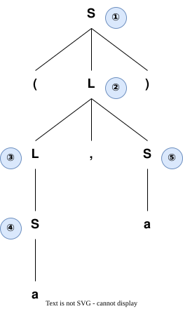
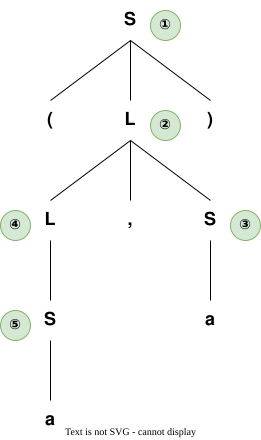
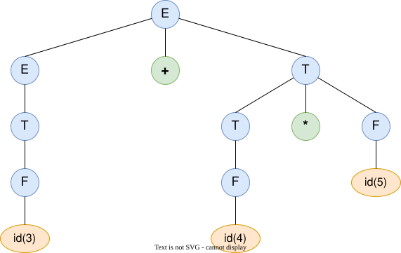
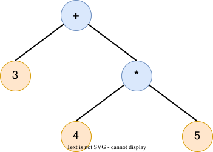

语法树是[[上下文无关文法]]（CFG）中句子推导过程的**图形化表示**。它展示了从开始符号出发，如何一步步应用产生式规则，最终得到目标句子。

语法树也称为**推导树**或**分析树**，是语法分析的核心结构。

## 2. 组成结构

- **根节点**：始终是文法的**开始符号**（通常为 $S$）
- **内部节点**：**非终结符**，表示推导过程中的中间状态
- **叶节点**：**终结符**（或 $\epsilon$），组成最终的句子
- **边**：表示产生式的应用关系，父节点通过产生式规则派生出子节点

## 3. 构造方法与推导的对应

语法树的构造过程与[[推导]]息息相关。虽然最终生成的语法树结构与推导顺序无关，但不同的推导方式决定了树节点的**扩展顺序**。

以文法为例：
$$
S \rightarrow (L) \mid a, \quad L \rightarrow L, S \mid S
$$

构造句子 $(a, a)$ 的语法树时，最左推导和最右推导的节点扩展顺序存在显著差异。图中带有序号的标签表示非终结符被替换（扩展）的先后顺序：

### 最左推导扩展顺序

最左推导每次优先展开最左侧的非终结符，表现为**从左到右、深度优先**的构造过程。

### 最右推导扩展顺序

最右推导每次优先展开最右侧的非终结符，表现为**从右到左、深度优先**的构造过程。

> 如果同一句子可以通过不同的推导方式生成**两棵结构完全不同**的语法树，则说明该文法是 [[二义性文法(Ambiguous Grammar)|二义性]] 的。

## 4. 抽象语法树 (Abstract Syntax Tree, AST)

在编译器中，语法分析的最终输出通常是抽象语法树（AST），而不是上述包含所有推导细节的具体分析树（Parse Tree）。
- AST 移除了括号、逗号等仅为满足文法推导规则而存在的冗余终结符节点。
- AST 仅保留程序的核心计算层次与语义结构。

**例子：表达式 `3 + 4 * 5`**

**具体分析树 (Parse Tree)** 会包含大量语法推导过程中的中间节点：

**抽象语法树 (AST)** 仅保留运算核心层次：

AST 的紧凑结构更适合后续的语义分析（如类型检查）与目标代码生成阶段进行处理。

## 5. 实际应用

在编译器中，语法树（尤其是抽象语法树）是**语法分析阶段**的核心输出载体。它连接了编译器的前端与后端，后续所有的优化、遍历与代码生成都依赖于这棵树的准确构建。
