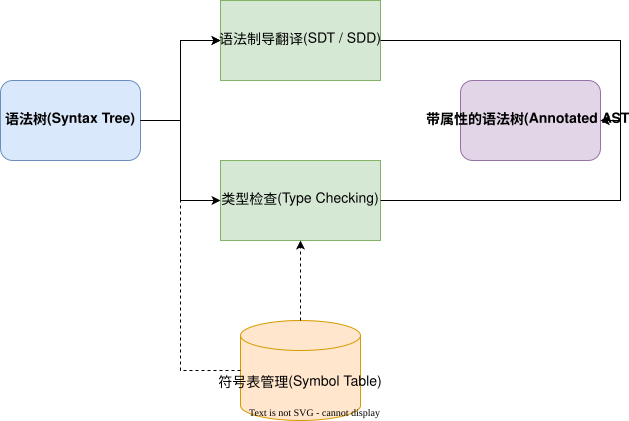

## 语义分析的核心任务

语义分析（Semantic Analysis）是编译器前端的最后一个阶段。语法分析虽然能够识别出程序的语法结构并生成语法树，但无法捕获上下文相关的约束（如变量是否已声明、类型是否匹配等）。语义分析的核心任务是进行**上下文相关分析**，确保程序在语义上是合法的。

主要涵盖以下几个方面：
- 依赖于[[属性文法]]来形式化描述语义规则。
- 通过[[语法制导定义(SDD)|语法制导定义]]和[[语法制导翻译方案(SDT)|语法制导翻译方案]]实现具体翻译。
- 借助[[符号表]]记录标识符的作用域和绑定信息。
- 进行静态[[类型检查]]，确保运算操作数的类型相容。

## 语义分析的工作流程

在整个编译器的流水线中，语义分析器接收[[语法分析器]]输出的抽象语法树（AST），结合符号表进行处理，最终输出一棵带有类型和其他语义信息的**带属性的语法树**（Annotated AST）。

- **输入**：抽象语法树。
- **处理**：遍历语法树节点，计算并传递综合属性与继承属性。
- **输出**：节点上绑定了具体语义值（如类型、作用域等）的语法树，为后续的中间代码生成提供基础。
