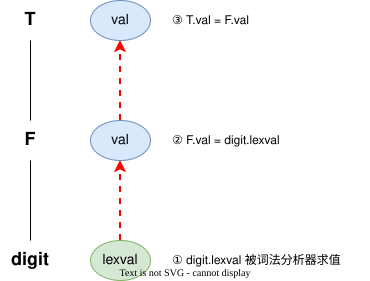

语法制导定义（Syntax-Directed Definition, SDD）是[[上下文无关文法]]和[[属性文法|属性]]及语义规则的结合。它是一种高度抽象的逻辑规范，旨在屏蔽具体的求值实现细节。SDD 仅描述如何根据产生式的语法结构计算相关属性，而不规定这些语义规则计算的先后顺序。

## S-属性定义与 L-属性定义

为了便于**在语法分析过程中同步进行语义求值**，通常对 SDD 的属性类别进行限制，形成两类常见的 SDD：

### S-属性定义 (S-Attributed SDD)

S-属性定义是最简单的一种 SDD，其核心特点是：
- 仅包含[[属性文法#综合属性 (Synthesized Attributes)|综合属性]]。
- 所有属性的值都可以通过自底向上的方式计算得出。
- 可以自然地与自底向上的语法分析（如 [[语法分析器#4.2 LR 分析法|LR分析]]）结合。在规约操作发生时，子节点的属性已全部求值，即可顺便计算父节点的属性。

### L-属性定义 (L-Attributed SDD)

L-属性定义的限制相对较宽，旨在能够与自左向右的自顶向下分析（如 [[LL(1)分析法|LL分析]]）配合使用。
其核心要求是，产生式右部符号的[[属性文法#继承属性 (Inherited Attributes)|继承属性]]，只能依赖于：
1. 产生式左部符号的继承属性。
2. 该符号在产生式右部**左侧兄弟节点**的属性（无论是综合还是继承属性）。
3. 该符号自身的其他已计算属性（不能形成循环依赖）。

这种从左到右（Left-to-right）的依赖限制，确保了在遍历[[语法树]]时，所需的属性值总能被提前计算好。

## 依赖图与求值顺序

在 SDD 中，不同节点之间的属性计算往往存在先后依赖关系。依赖图（Dependency Graph）用于描述这些属性实例之间的数据流向。

- 图中的节点表示语法树节点的属性。
- 如果属性 $b$ 的计算依赖于属性 $c$，则依赖图中存在一条从 $c$ 指向 $b$ 的有向边。

只要依赖图中不存在环，就可以通过**拓扑排序**（Topological Sort）找出一个合法的求值顺序。如果包含**循环依赖**，则该 SDD 是无法求值的。在实际的编译器实现中，通常会利用[[语法制导翻译方案(SDT)]]将这些逻辑规则转化为具体执行的语义动作。