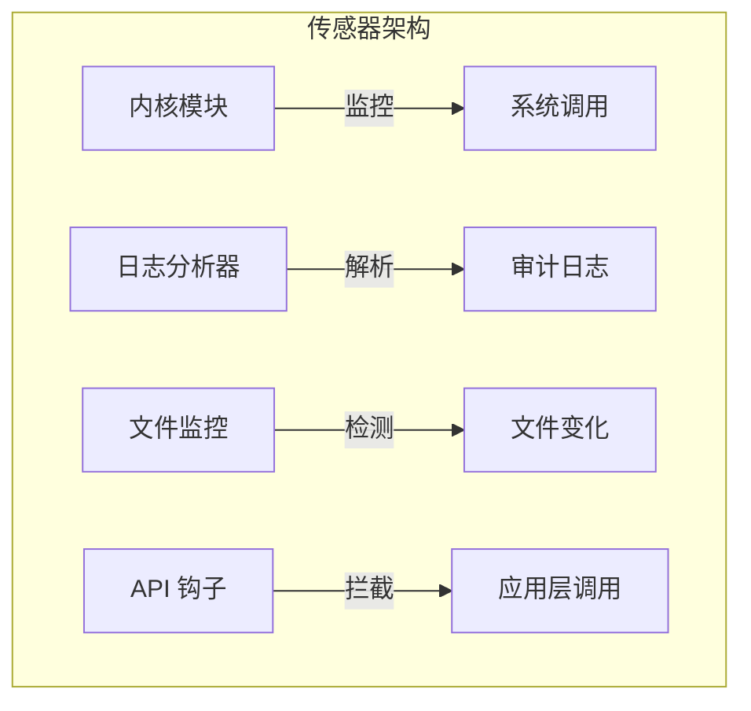

主机入侵检测（HIDS）部署在单台主机内部，能够监控网络层无法捕获的深层活动。相比于侧重流量分析的网络级防御，HIDS 提供更精细的系统级审计。

## 核心优势

- **检测内部威胁**：内部人员的恶意操作或本地特权提升攻击通常不会经过网络边界，只有 HIDS 能够捕获。
- **处理加密流量**：网络级防御无法解析加密后的乱码，而 HIDS 在终端主机上、数据解密之后进行检查，不受加密影响。
- **监控系统级活动**：HIDS 能够监控文件完整性变化、注册表修改、进程活动以及系统调用等底层行为。
- **应对物理与横向攻击**：例如通过物理接触（U盘植入恶意软件）或内部网络横向移动发起的攻击，往往能绕过外部的网络防御盲区。

## 数据源与传感器

主机入侵检测的核心在于收集主机内部的底层活动数据，多数据源的交叉验证能够有效提升检测的准确性。单一数据源容易被攻击者规避（例如删除审计日志或注入合法进程）。

### 主要数据源

| 数据源         | 监控内容                   | 典型威胁检测     |
| -------------- | -------------------------- | ---------------- |
| **系统调用**   | 程序调用了哪些内核接口     | 恶意程序行为分析 |
| **审计日志**   | 用户的具体操作记录与时间   | 用户活动追踪     |
| **文件完整性** | 文件的修改、新增或删除     | 篡改、后门植入   |
| **注册表**     | Windows 配置项的变动       | 恶意配置修改     |
| **进程活动**   | 进程的创建、终止与权限变化 | 恶意进程检测     |

### 传感器架构

为了采集上述数据，HIDS 使用了多种特定类型的传感器：

- **内核模块**：深入操作系统内核，直接监控系统调用和内核级活动（例如 Linux Audit）。
- **日志分析器**：实时读取和解析操作系统与应用程序的日志文件（例如 OSSEC、Splunk）。
- **文件监控传感器**：监控文件系统变化。通常在系统干净时计算关键文件的哈希值建立基线，随后定期比对，若哈希值改变则触发文件被篡改的警报（例如 Tripwire）。
- **API 钩子**：拦截并分析应用程序级别的 API 调用（例如 Windows ETW）。

## 检测引擎分类

根据检测原理的不同，HIDS 引擎主要分为以下几类，且往往结合使用：

- [[异常检测]]：建立系统调用或用户行为的正常基线，监控深层活动的偏离情况。
- [[签名检测]]：匹配已知的文件签名、特定的日志输出以及高危系统配置特征。
- [[启发式检测]]：通过专家规则评估系统操作与行为序列的潜在恶意程度。

### 分布式 HIDS：
在拥有大量服务器的企业环境中，单台主机的 HIDS 往往无法看清全局攻击。分布式架构将分散在各主机的传感器数据汇聚至中央服务器，通过关联分析发现跨主机的攻击链（如从主机 A 进入，横向移动到主机 B，再在主机 C 提权）。