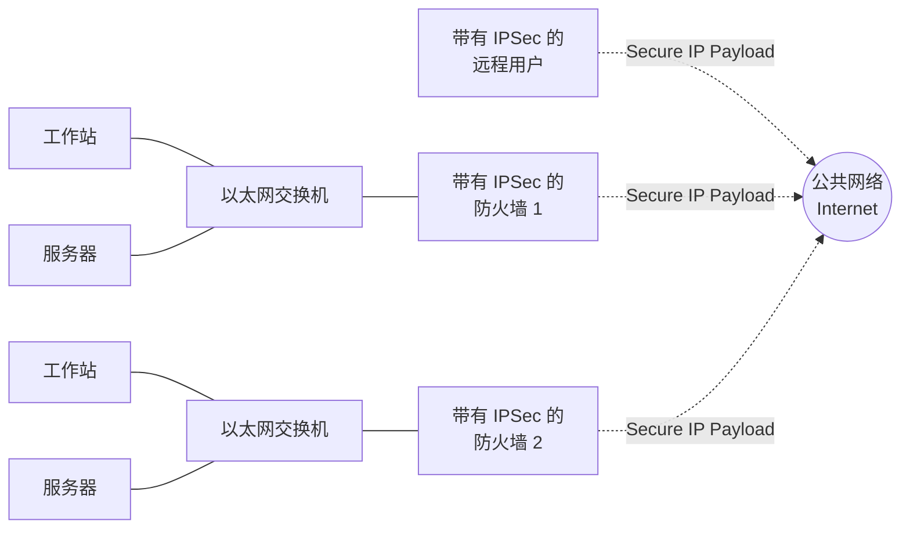

## 虚拟专用网 (Virtual Private Networks, VPN)

> [!info] 需求背景
> 企业常常需要将分布在不同地理位置的局域网（LAN）连接起来。使用 Internet 等公共网络互连可以节约成本并减轻广域网（WAN）管理负担，同时也方便远程办公的员工接入。但公共网络存在窃听和未授权访问风险。

VPN 是由一组通过相对不安全的网络互连的计算机组成，利用**加密**和**特殊协议**来提供安全性。VPN 通过在底层协议中使用加密和认证，在不安全的网络（通常是 Internet）中提供安全连接。

### VPN 的实现机制 (IPSec)

> 用于实现 VPN 的最常见协议机制位于 IP 层，称为 **IPSec**。

VPN 依赖于两端使用相同的加密和认证系统。这种加密可以由**防火墙软件**或路由器来执行。

**工作原理**：
1. **网关到网关**：网络设备（如带有 IPSec 的防火墙）将进入 WAN 的所有流量进行加密和压缩，并对来自 WAN 的流量进行解密和解压缩。。
2. **端到网关**：拨号进入 WAN 的个体远程用户工作站必须自行实现 IPSec 协议，并具备高水平的主机安全，因为它们直接暴露在 Internet 中，容易成为攻击者的目标。

### IPSec 的实施位置
- **在防火墙中实施**：最合乎逻辑。
- **在防火墙内部（后方）实施**：如果 IPSec 在防火墙后方的独立设备中实施，那么双向穿过防火墙的 VPN 流量都是加密的，这会导致**防火墙无法执行其过滤、访问控制、日志记录或病毒扫描等安全功能**。
- **在边界路由器（防火墙外部）实施**：设备通常不如防火墙安全，不是理想的 IPSec 平台。