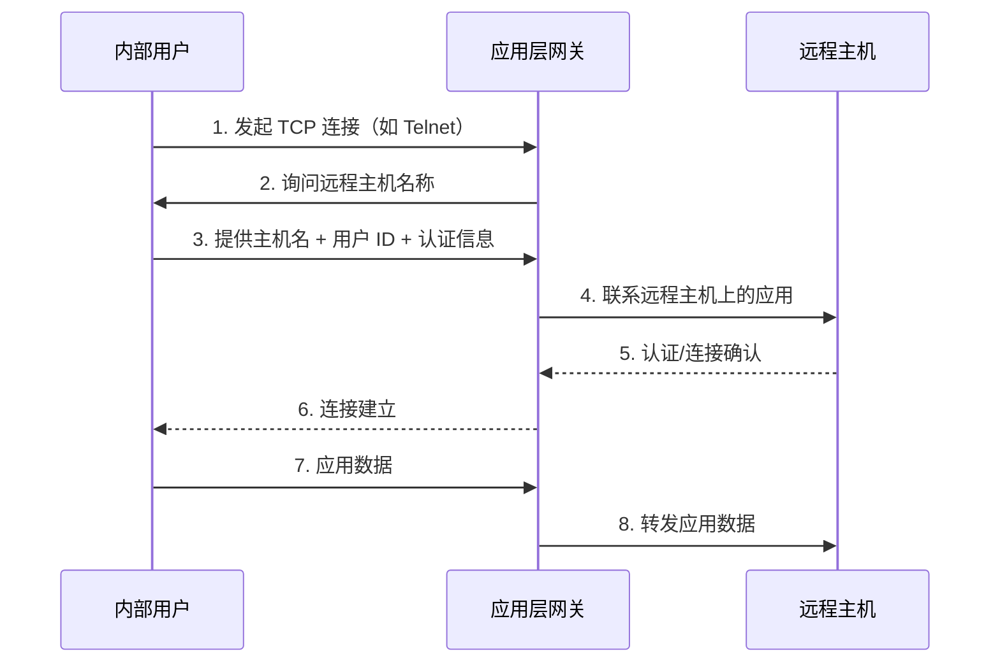

充当应用层流量的**中继**。用户通过 TCP/IP 应用（如 Telnet、FTP）联系网关，网关在**验证用户身份**后，将应用数据的 TCP 段在两端点之间转发。

## 工作流程
用户联系网关后，网关要求提供**远程主机名称**、**用户 ID** 和**认证信息**。只有认证通过后，网关才会代为联系远程主机并建立连接。

> [!tip] 关键特征
> 网关处于两条拼接连接（Spliced Connections）的**拼接点**，必须检查并转发两个方向的所有流量。

---
## 作用

### 应用层深度协议感知
能完整解析 HTTP、HTTPS、FTP、SMTP、DNS、SSH 等应用层协议的语义，识别协议命令、请求方法、数据载荷的具体含义，而非仅基于 IP 地址、端口号等网络头部信息做判断。

### 细粒度访问控制能力
控制维度可精确到**用户、应用功能、内容**层级

> [!example] FTP 指令过滤
> 代理可配置为仅放行 `RETR`（下载）指令，同时拦截 `STOR`（上传）指令，从而在保障外部资源获取的同时，防范内部数据外泄。

### 阻断直接攻击路径
外部所有连接的对端都是应用层网关，端口扫描、SYN 洪水、畸形 TCP 报文等网络层 / 传输层攻击只能触达网关，无法直接作用于内部主机，从物理路径上缩小攻击面，保护内部资产不被直接探测和攻击。

---

## 局限性

- **额外处理开销** — 每个连接都需要在网关处进行拼接，网关必须检查并转发两个方向的所有流量
- **灵活性差** — 每种应用协议需要专门的代理代码，新协议需开发新代理
- **单点故障** — 代理服务器宕机将中断所有经其转发的连接

