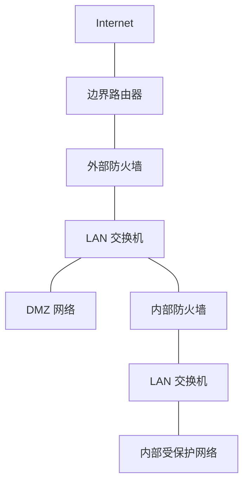

防火墙位于外部（不可信）流量源与内部网络之间，提供保护屏障。安全管理员需要决定防火墙的**部署位置**和**数量**。最常见的配置方式是采用内外两层防火墙，并在之间设置 DMZ 网络。

---

## DMZ 网络 (DMZ Network)

**DMZ（Demilitarized Zone，非军事区）** 是位于外部防火墙与内部防火墙之间的网络区域。需要对外提供服务但又需要一定保护的系统通常部署在 DMZ 中，如企业网站、邮件服务器、DNS 服务器等。

### 典型拓扑

> [!note] 拓扑要点
> - **外部防火墙**部署在企业网络边缘，位于边界路由器内侧
> - **DMZ** 位于外部防火墙与内部防火墙之间，通过 LAN 交换机连接
> - **内部防火墙**保护企业内部网络的核心资源
> - DMZ 通常连接到外部防火墙的**不同于内部网络的网络接口**

---

## 外部防火墙的职责

- 为 DMZ 系统提供与其外部连接需求一致的**访问控制和保护**
- 为整个企业网络提供**基础级别的保护**

---

## 内部防火墙的三大作用

### 1. 更严格的过滤

> 内部防火墙提供比外部防火墙**更严格的过滤能力**，保护企业服务器和工作站免受外部攻击。

### 2. 对 DMZ 的双向保护

- **阻止 DMZ → 内部** — 防止从 DMZ 系统发起的攻击渗透到内部网络。此类攻击可能源于[[蠕虫]]、Rootkit、Bot 或其他驻留在 DMZ 系统中的恶意软件
- **阻止内部 → DMZ** — 同时也保护 DMZ 系统免受来自内部受保护网络的攻击

### 3. 内部网段隔离

> 多个内部防火墙可用于**隔离内部网络的不同区域**。例如：用内部防火墙将内部服务器与内部工作站相互保护，防止一个网段的威胁扩散到另一个网段。

---

## 关键设计原则

- **外部防火墙**侧重于基础过滤和 DMZ 的外部访问控制
- **内部防火墙**侧重于深度过滤和多方向保护
- DMZ 与内部网络应使用**不同的网络接口**连接到外部防火墙
- 多道防火墙构成**纵深防御**，任一道被突破后仍有后续防护

---
## 分布式防火墙 (Distributed Firewalls)

> 分布式防火墙配置包括**独立防火墙设备**和[[防火墙部署#主机防火墙 (Host-Based Firewall)|主机防火墙]]，它们在统一的中心管理控制下协同工作。

### 组成

1. **中心管理工具**：允许网络管理员在整个网络范围内设置策略并监控安全。
2. **主机防火墙**：配置在数百台服务器、工作站和远程用户系统上。针对特定机器和应用程序提供量身定制的保护，防止内部攻击。
3. **独立防火墙**：提供全局保护，包括前面讨论的内部防火墙和外部防火墙。

