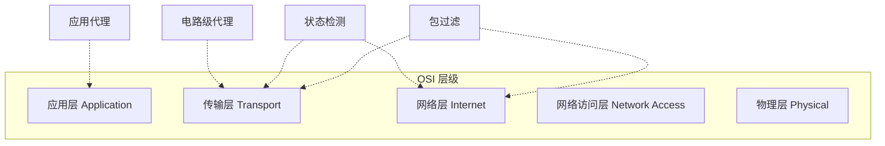

防火墙可以监控不同层级的网络流量，从底层的数据包到应用层协议。具体选择哪种层级，取决于所需的访问策略。

## 四种类型对比

| 对比维度           | [[包过滤防火墙]] (Packet Filtering) | [[状态检测防火墙]] (Stateful Inspection) | [[应用层网关]] (Application Proxy) | [[电路级网关]] (Circuit-level Proxy) |
| ------------------ | -------------------------------------- | ------------------------------------------- | ------------------------------------- | --------------------------------------- |
| **工作层级**       | 网络层 / 传输层                        | 网络层 / 传输层                             | **应用层**                            | **传输层**                              |
| **连接隔离**       | 否                                     | 否                                          | **是（两条拼接连接）**                | **是**                                  |
| **连接状态跟踪**   | 不跟踪                                 | **跟踪（维护状态表）**                      | 是                                    | 是                                      |
| **应用层检查**     | 否                                     | 有限                                        | **完全**                              | 否                                      |
| **数据包判断依据** | 仅规则集                               | 规则集 + 状态表                             | 应用层解析与过滤                      | 连接允许/拒绝策略                       |
| **性能**           | 高                                     | 中                                          | 低                                    | 中高                                    |
| **安全性**         | 低                                     | 中                                          | **高**                                | 中高                                    |
| **灵活性**         | 高                                     | 中                                          | 低（每种协议需专门代理）              | 高（通用性强）                          |

---

## 各类型详解

| 防火墙类型       | 一句话概括               |
| ----------- | ------------------- |
| [[包过滤防火墙]]  | 逐包检查 IP/端口，速度快但安全性低 |
| [[状态检测防火墙]] | 在包过滤基础上增加状态表，跟踪连接   |
| [[应用层网关]]   | 深度检查应用层数据，安全性最高     |
| [[电路级网关]]   | 传输层中继，隐藏内部地址        |

---

## 工作层级示意

> [!tip] 选择建议
> 实际部署中，往往将多种类型的防火墙**组合使用**（如状态检测 + 应用代理），在性能与安全之间取得平衡。

