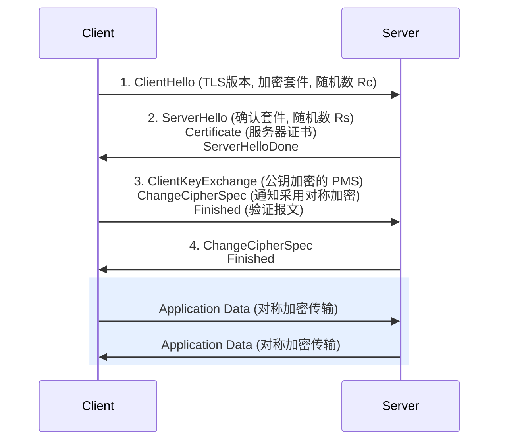

## 万维网基础

万维网 (WWW, World Wide Web) 是一个大规模的、分布式的超媒体信息检索系统。它由三个核心部分组成：
1. **URL (统一资源定位符)**：用于在全球范围内唯一标识网络上的资源。
2. **HTML (超文本标记语言)**：用于编写和呈现网页内容的标记语言。
3. **HTTP (超文本传输协议)**：用于在客户端（浏览器）和服务器之间传输超文本数据的应用层协议。

## HTTP 协议原理

HTTP 是一种无状态的、基于请求-响应模式的协议。它底层依赖于[[传输层/TCP协议与状态机|TCP 协议]]（默认端口 80）来保证数据的可靠传输。

### HTTP 请求报文
一个标准的 HTTP 请求报文由请求行、请求头、空行和请求体组成。
- **请求行**：包含请求方法、请求 URL 和 HTTP 版本。常见的请求方法及其语义如下：
	- **GET**：请求获取指定资源。GET 请求应当是安全的、幂等的（即多次执行产生的效果与一次执行相同），不应产生副作用。
	- **POST**：向指定资源提交数据（如提交表单或上传文件），以进行处理。POST 请求通常会导致服务器状态的改变或新资源的创建。
	- **PUT**：替换指定资源的当前表示。如果资源不存在，则创建该资源。PUT 请求也是幂等的。
	- **DELETE**：请求服务器删除指定的资源。DELETE 请求同样是幂等的。
- **请求头 (Headers)**：提供关于客户端环境和请求正文的附加信息（如 `User-Agent`, `Host`, `Accept`）。
- **空行 (Blank Line)**：由回车符和换行符（CRLF）组成，作为请求头结束的标志，用来通知服务器接下来的内容是请求体。
- **请求体 (Body)**：主要用于承载需要发送给服务器的数据。通常在使用 POST 或 PUT 方法时存在（如提交的表单数据、JSON 格式的数据负载、上传的文件等）。GET 或 DELETE 请求通常不包含请求体。

### HTTP 响应报文
HTTP 响应报文由状态行、响应头、空行和响应体组成。
- **状态行**：包含 HTTP 版本、状态码和状态描述。常见的状态码类别包括：
  - `1xx`：信息性提示。
  - `2xx`：成功（如 `200 OK`）。
  - `3xx`：重定向（如 `301 Moved Permanently`）。
  - `4xx`：客户端错误（如 `404 Not Found`）。
  - `5xx`：服务器错误（如 `500 Internal Server Error`）。

## HTTP 的演进与持久连接

### HTTP/1.0 与非持久连接
在 HTTP/1.0 中，默认采用非持久连接。浏览器每请求一个资源（如 HTML 文件、图片、CSS 文件），都需要重新建立一次 TCP 连接。这导致了巨大的延迟，因为每次连接都需要经历[[传输层/TCP协议与状态机#三次握手建立连接|TCP 三次握手]]。

### HTTP/1.1 与持久连接
HTTP/1.1 引入了持久连接 (Persistent Connection, `Connection: keep-alive`)。在同一个 TCP 连接上可以发送多个 HTTP 请求和响应，显著降低了建立连接的开销。此外，HTTP/1.1 还支持管道化 (Pipelining)，允许客户端在收到前一个响应之前连续发送多个请求。

### HTTPS
HTTP 是明文传输的，存在被窃听和篡改的风险。HTTPS (HTTP Secure) 在 HTTP 和 TCP 之间加入了一个安全层（TLS/SSL）。TLS 负责在数据传输前对双方进行身份验证，并对传输的数据进行对称加密，从而保证了通信的机密性和完整性。在建立 HTTPS 连接时，除了 TCP 握手外，还需要进行 TLS 握手。

### TLS 握手过程

TLS (Transport Layer Security) 的核心目的是在不安全的网络上安全地协商出一个**对称加密密钥**（会话密钥），以供后续的应用数据加密阶段使用。
- 握手阶段利用[[非对称加密]]来解决对称密钥的安全分发问题。
- 握手完成后，双方使用协商好的主密钥，通过高效的[[对称加密]]机制对应用层的大量 HTTP 数据进行机密传输。

以经典的 RSA 密钥交换为例，TLS 握手需要经历以下核心步骤：

1. **ClientHello**：客户端发起连接请求，向服务器发送自己支持的 TLS 版本、加密套件列表，以及一个客户端生成的随机数 $R_c$。
2. **ServerHello 与证书发送**：服务器确认 TLS 版本，从列表中选择一个加密套件，生成一个服务器随机数 $R_s$，并将其连同自己的**公钥证书**发送给客户端。最后发送 `ServerHelloDone` 标志。
3. **ClientKeyExchange**：客户端验证服务器证书的合法性。验证通过后，客户端生成一个预主密钥 (Pre-Master Secret, PMS)，并使用服务器的公钥对其加密后发送。随后发送 `ChangeCipherSpec` 通知服务器此后将采用加密通信，并发送 `Finished` 报文供服务器校验。
4. **ServerFinished**：服务器使用自己的私钥解密得到 PMS。此时双方都有了 $R_c$、$R_s$ 和 PMS，各自独立计算出最终的**主密钥 (Master Secret)**，即会话密钥。服务器随后同样发送 `ChangeCipherSpec` 和 `Finished`。

